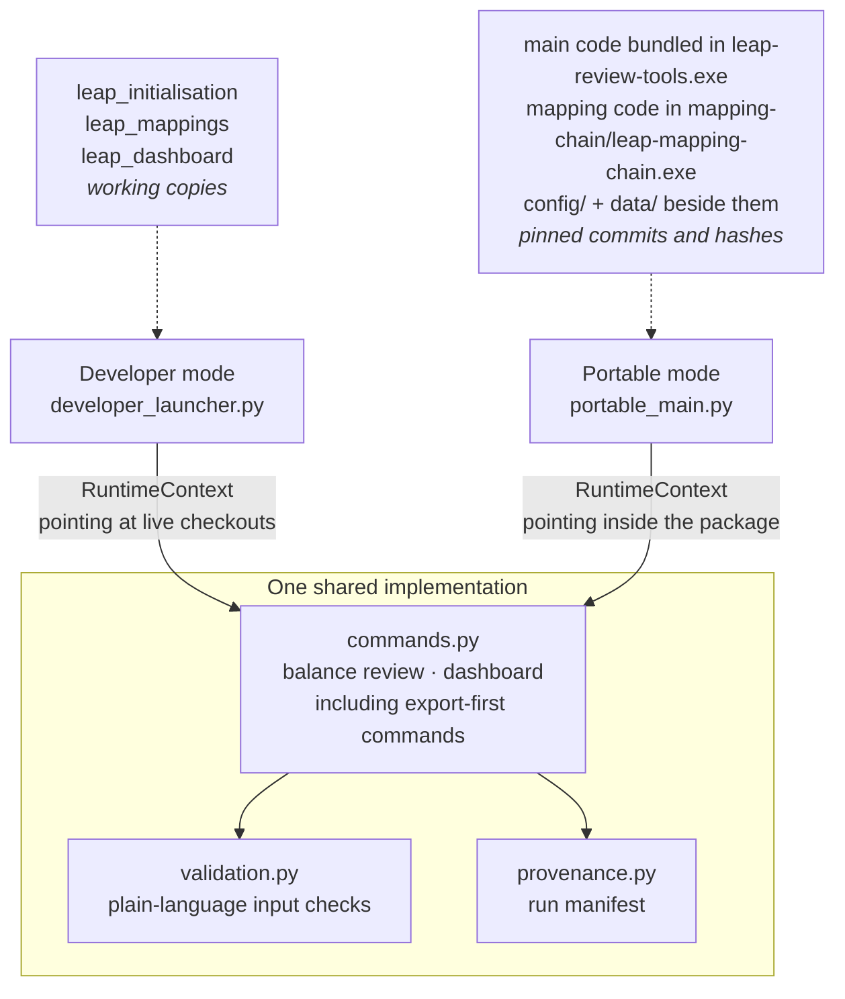
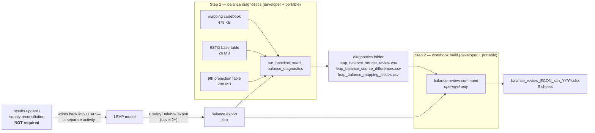
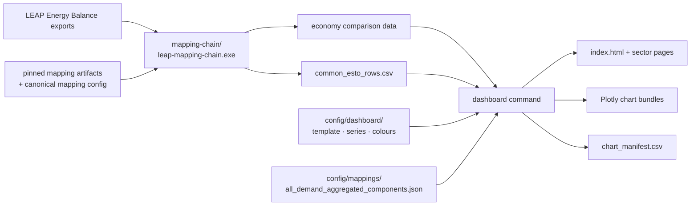
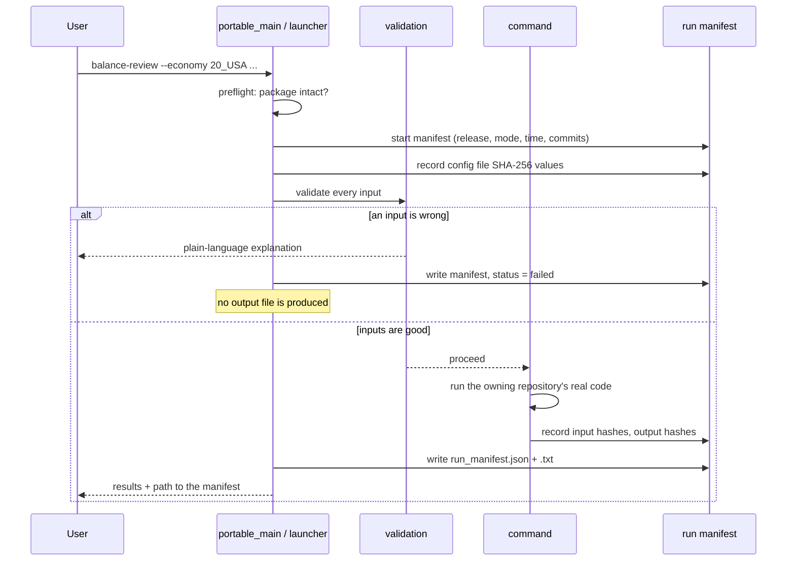
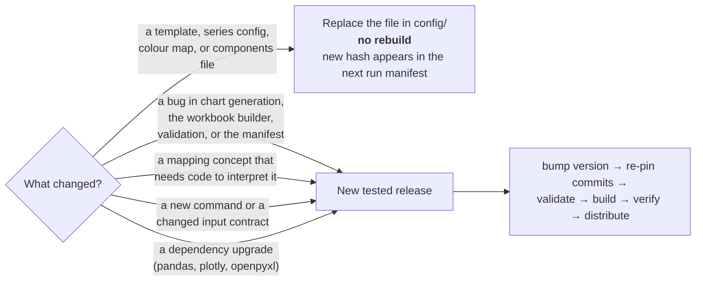
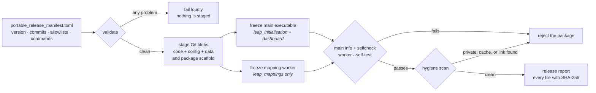
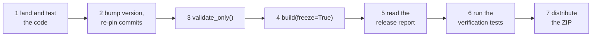

# What this is

Two LEAP review tools — the **Common ESTO dashboard** and the **balance-review
workbook** — can now be run in two different ways by two different kinds of
user, from the same code.

**Developer mode** is for the maintainer. It runs directly against the live
`leap_initialisation`, `leap_mappings`, and `leap_dashboard` working copies. A
fix made in any of those repositories takes effect on the very next run, with no
build step.

**Portable release mode** is for a colleague. It is a versioned Windows folder
built from an exact, tested set of repository commits. The colleague needs no
Python, no Conda, no Git, and none of the three repositories — they unzip a
folder and run an executable.

The important design property is that these are not two programs. They are one
program with two ways of finding its own parts.



Because both modes call the same `commands.py`, they cannot drift apart in
behaviour. The only thing that differs is a small object called the
`RuntimeContext`, which answers four questions for a run: where the code is,
where the configuration is, where outputs go, and what provenance to record.

\newpage

# The two tools, and what they actually need

This is the part most worth understanding before using either tool, because the
inputs are not what people usually assume.

## The balance-review workbook

The workbook's entire content is a **comparison** between what LEAP produced and
what the source data says. That comparison is not in the LEAP export — it is
computed by a separate **balance diagnostics** step, which reads the export
alongside the mapping codebook and the ESTO and 9th-edition source tables.

A fresh LEAP export is enough to produce a workbook. Getting there is two steps,
and `balance-review-from-export` runs both in developer and portable modes.



`_PRESET_REVIEW_ONLY` in `balance_update_workflow.py` runs both steps in one
call, with the results update switched off. So in developer mode a new export
goes straight to a workbook.

**A results update / supply reconciliation run is not required.** That workflow
writes values back into LEAP and is a separate, optional activity; producing a
review workbook does not involve it.

The portable release ships both steps. It is consequently large: step 1 needs
the ESTO base table and the all-economy 9th-edition projection table. Those
read-only inputs are pinned by SHA-256 in the release manifest, and neither step
needs LEAP COM or a results-update run.

The workbook that comes out has five sheets:

| Sheet | What it shows |
|---|---|
| LEAP Values | the balance exactly as LEAP produced it, converted to PJ |
| LEAP - Source Error | LEAP minus source, red where they disagree |
| Correct Source Values | what the source says the value should be |
| Full Expected Source | the same, with structurally absent cells greyed |
| Missing Combinations | every comparison that could not be made, and why |

## The Common ESTO dashboard



`dashboard-from-export` avoids transferring the full all-economy comparison
file: the isolated mapping worker builds the requested economy's comparison
data from the exports. The older `dashboard` command remains as an escape hatch
for an existing comparison file.

Three dashboard pages are deliberately **not** in the portable release — the
mapping-diagnostics page, the full mapping tree explorer, and the capacity-unmet
convergence page. Each reads `leap_mappings` or `leap_initialisation` artifacts
that a package does not carry. Use the full workflow script for those.

\newpage

# What happens during a run

Every run of either tool, in either mode, follows the same sequence. The
validation step comes first and completely: a colleague finds out that a file is
missing, is the wrong kind of file, or does not cover the economy they asked for
*before* anything slow starts.



## The run manifest

Every run writes a dated folder containing its results, `run_manifest.json`,
`run_manifest.txt`, and `validation_report.txt`. The manifest answers the
questions someone asks weeks later:

- which release version and which mode;
- when it ran;
- which input files, with size and SHA-256 — so "was it the file I think it
  was?" has an answer;
- which mapping and configuration files were in force, by SHA-256;
- which repository commits the code came from;
- in developer mode, whether each working tree was **dirty** — a dirty tree
  means the run used code that is in no commit and cannot be reproduced.

## The support bundle

Adding `--support-bundle` produces a ZIP containing the run manifest, the
validation report, the effective settings, and the logs. It deliberately
contains **no input data** — it is meant to be emailed, and the manifest already
records each input's identity by hash.

\newpage

# Using developer mode

## One-time setup

Developer mode reads exactly one settings file, and nothing is inferred from the
current working directory. That means the launcher behaves identically from a
notebook, a terminal, or an IDE run configuration.

```bash
"C:/Users/Work/miniconda3/python.exe" -c "import sys; sys.path.insert(0,'.'); from codebase.portable_release.settings import write_example_settings; print(write_example_settings())"
```

This writes `%LOCALAPPDATA%\leap-review-tools\developer_settings.toml`,
pre-filled with the repositories it can detect. Edit the paths if needed. The
file lives outside the repositories on purpose: it holds machine-specific
absolute paths that must not be committed.

## Check before you run

```python
from codebase.portable_release import developer_launcher as dev
dev.print_status()
```

This prints the resolved repositories, the configuration files it will read, the
output folders, a preflight result for every required location, and each
repository's commit and dirty state.

## Run a tool

```python
result = dev.run_balance_review(
    economy="20_USA",
    scenario="Target",
    year=2022,
    balance_export_workbook=r"...\20_USA\TGT 0308.xlsx",
    diagnostics_directory=r"...\results_update_preview_20260803_usa_tgt",
)

result = dev.run_dashboard(
    economy="20_USA",
    comparison_data_path=r"...\common_esto\common_esto_comparison_data.csv",
    common_rows_path=r"...\common_esto\common_esto_rows.csv",
)
```

`developer_launcher.py` also has a `#%%` notebook block at the bottom: set
`RUN_DEVELOPER_LAUNCHER = True`, choose `DEVELOPER_ACTION`, fill in the
constants, and run the cell.

## Updating the repositories safely

Nothing pulls silently. Plain `git pull` in each checkout remains perfectly
good; if you would rather drive it from the launcher:

```python
dev.plan_repository_update()           # shows what it would do, fetches nothing
dev.update_repositories()              # prints the plan, still pulls nothing
dev.update_repositories(confirm=True)  # fast-forwards, skipping dirty repos
```

It refuses any repository with uncommitted changes and any branch with no
upstream, and only ever runs `git pull --ff-only`.

\newpage

# Using a portable release

Extract the folder anywhere and run the executable. There is no installer.

```text
leap-review-tools-0.1.0/
  leap-review-tools.exe      the program
  _internal/                 its bundled Python runtime — do not edit
  mapping-chain/             isolated mapping worker executable + runtime
  config/                    approved mapping and template files — editable
  data/                      pinned source tables and mapping artifacts
  input/                     put your input files here
  output/                    one dated folder per run
  logs/                      run logs
  licenses/                  third-party licence texts
  README.md
  release_manifest.json      exactly which commits this was built from
```

Double-click the executable for a guided flow that lists the commands, explains
each input, and asks for them one at a time. Or drive it from a terminal:

```bash
leap-review-tools.exe info
```

```bash
leap-review-tools.exe selfcheck
```

```bash
leap-review-tools.exe list
```

```bash
leap-review-tools.exe balance-review --economy 20_USA --scenario Target --year 2022 --balance-export-workbook "input\TGT 0308.xlsx" --diagnostics-directory "input\usa_tgt_diagnostics"
```

```bash
leap-review-tools.exe dashboard --economy 20_USA --comparison-data-path "input\common_esto_comparison_data.csv" --common-rows-path "input\common_esto_rows.csv"
```

For the usual export-first workflow, place workbooks under
`input\leap balances exports\<ECONOMY>\` and run:

```bash
leap-review-tools.exe balance-review-from-export --economy 20_USA --scenario Target --year 2022
```

```bash
leap-review-tools.exe dashboard-from-export --economy 20_USA
```

`selfcheck` imports everything a run needs, confirms each standard-library
module it relies on is the real one, and checks that every configuration file
and package folder is present. Run it first if anything looks wrong — it is also
what the builder runs against a freshly frozen executable before accepting it.

## Windows prerequisites

- **Excel is not required.** The workbook is written with `openpyxl` and the
  dashboard is HTML and JavaScript. Excel is only needed to *open* the resulting
  workbook, which recalculates its formulas on first open.
- **SmartScreen.** The executable is not code-signed, so Windows shows "Windows
  protected your PC" on first run. Choose *More info → Run anyway*, or have an
  administrator whitelist it.
- **Antivirus.** PyInstaller builds are occasionally flagged by heuristic
  scanners. Distribute as a ZIP from a trusted internal location.
- **Path length.** Extract somewhere short, such as
  `C:\Tools\leap-review-tools-0.1.0`, rather than deep inside a OneDrive tree.

\newpage

# Changing mappings and settings without rebuilding

This is the part that saves the most time in practice.

Everything under a release's `config/` folder is read at start-up, and its
SHA-256 is recorded in every run manifest.

| File | Role |
|---|---|
| `config/dashboard/common_esto_dashboard_template.json` | page rules, chart generation, sign semantics |
| `config/dashboard/series_config.json` | series labels, visible-series rules, economy list |
| `config/dashboard/code_colors.json` | per-axis ESTO code colours |
| `config/mappings/all_demand_aggregated_components.json` | which demand sectors have no separately modelled LEAP detail |
| `config/mappings/outlook_mappings_master.xlsx` | canonical LEAP-to-ESTO mappings |
| `config/mappings/source_branch_fallback_rules.csv` | interim-branch fallback rules |
| `config/balance_review/synthetic_reference_rows.csv` | ESTO vintage-alignment rows |
| `config/balance_review/leap_results_sheet_map.csv` | LEAP sheet/scenario resolution |
| `config/balance_review/leap_explicit_reassignments.csv` | reviewed balance-row reassignments |
| `config/balance_review/balance_error_signal_rules.csv` | variable roles and error-signal rules |

Replacing one of these with an approved newer version changes the next run's
behaviour immediately, with **no rebuild** — and the change is never invisible,
because the new hash appears in that run's manifest.



The canonical mapping workbook is packaged beside the executables as a
configuration asset, and neither command edits it. Make maintained changes in
`leap_mappings`, regenerate the pinned mapping artifacts, and build a new
release so the workbook and data snapshots stay consistent.

> One detail worth knowing: developer mode reads these files from the live
> checkouts (CRLF line endings on Windows) while a release reads them from Git
> blobs (LF). The same logical file therefore has a different SHA-256 in the two
> modes. That is expected — the hash identifies the bytes actually read.

\newpage

# How a release is built

The release contract is a single reviewed file,
`config/portable_release_manifest.toml`. It declares the semantic version, the
exact 40-character commit of every participating repository, every source path
that may be copied, every external configuration asset, the supported commands
and their input/output contracts, and the runtime packages.



Two properties are worth calling out because they were learned the hard way.

**Everything is read out of Git at the pinned commit.** The builder never checks
out, resets, stashes, or otherwise touches a working tree, so uncommitted
work-in-progress cannot reach a colleague's copy — and a release is reproducible
from the manifest alone.

**PyInstaller builds two isolated targets from a directory containing none of
the repositories.** Both source repositories use the top-level package name
`codebase`, so they cannot safely share one Python process or executable. The
main executable bundles `leap_initialisation` and dashboard code; the mapping
worker bundles `leap_mappings` and exchanges one JSON job/result with the main
process. Build isolation also prevents a maintainer's live checkout from being
silently included.

## Validation is strict on purpose

The manifest validator rejects a release before anything is staged if:

- a commit is abbreviated rather than a full 40-character SHA;
- a referenced commit or file does not exist;
- a path escapes a repository root, or sits under a private, generated, or cache
  directory (`.git`, `.codex`, `.claude`, `node_modules`, `outputs`, `data`, …);
- a source allowlist entry is not a whole Python module — configuration and
  templates must go in `config_assets` so they stay replaceable;
- a configuration asset is over 8 MB, which almost always means generated data
  has been allowlisted by mistake;
- a declared command has no implementation.

## Release and rollback



Rolling back is simply rebuilding an older manifest:

```bash
git show <commit>:config/portable_release_manifest.toml > rollback.toml
```

then `build_release.build("rollback.toml")`. Because every commit is pinned, the
rebuild is identical in source content regardless of what the repositories look
like now. To identify what a colleague is running, read `release_manifest.json`
in their package folder.

Do not overwrite a released version number with different content — bump the
patch version instead, so a run manifest always identifies exactly one build.

\newpage

# Known limitations

- **The package is large.** The export-first commands require the ESTO and
  9th-edition source tables plus four mapping artifacts. These are snapshots;
  refreshing their vintages or mappings requires a newly built release.
- **Three dashboard pages are not in the release** — mapping diagnostics, the
  full mapping tree explorer, and capacity-unmet convergence. They read
  `leap_mappings` and `leap_initialisation` artifacts a package does not carry.
- **No upstream data refresh.** The release computes model-run-specific results
  from exports but does not download or regenerate its pinned reference data.
- **Sheet-image previews are unavailable.** The Python workbook builder writes
  XLSX and verifies it structurally, but does not render sheet images. This is
  the one capability the earlier Node-based builder had that is not replaced.
- **A full dashboard render takes a few minutes per economy**, dominated by
  writing Plotly chart bundles.
- **The executable is not code-signed** — see SmartScreen, above.

## Codex-only functionality

There is none left in the supported commands, and this was checked rather than
assumed. The balance-review workbook builder was migrated off
`@oai/artifact-tool` and Node.js to pure Python and `openpyxl`; `leap_mappings`
migrated its own workbook builders the same way. The only casualty of that
migration is preview rendering, above.

What was verified: the release's declared dependency closure contains no Node.js
package and no Codex-managed component; the built package contains a Python
runtime and nothing else executable; and all four declared command variants run
from the frozen package, whose bundles contain no Node.js.

\newpage

# Where things live

| What | Where |
|---|---|
| Launcher, builder, runtime, validation, provenance, portable entry point | `leap_initialisation/codebase/portable_release/` |
| Release contract | `leap_initialisation/config/portable_release_manifest.toml` |
| Developer settings example | `leap_initialisation/config/leap_review_tools_settings.example.toml` |
| Full reference documentation | `leap_initialisation/docs/leap_review_tools.md` |
| Packageable dashboard render entry point | `leap_dashboard/codebase/common_esto_dashboard_portable.py` |
| Isolated mapping worker | `leap_mappings/codebase/portable_mapping_chain.py` and its allowlisted mapping-tool closure |
| Mapping configuration and generated artifacts | `leap_mappings/config/` and the manifest-declared files under `leap_mappings/results/` |
| Generated staging, build, and package trees (git-ignored) | `leap_initialisation/release_build/` |

## Tests

```bash
"C:/Users/Work/miniconda3/python.exe" -m pytest tests/test_portable_release.py tests/test_portable_release_golden_balance_review.py tests/test_portable_release_package.py -q
```

| Test module | What it defends |
|---|---|
| `test_portable_release.py` | manifest parsing and validation, path safety, developer settings, run manifest, runtime context, input validation messages |
| `test_portable_release_golden_balance_review.py` | the USA 2022 golden case: structural contract, selected core values, exact reproduction of the historical reference workbook, and that no source input was modified |
| `test_portable_release_package.py` | a staged package: layout, no private or generated content, **no imports from the live repositories**, a real run's outputs and manifest, config-edit detection, invalid-input behaviour |

The golden and package tests skip cleanly on a machine without the large local
inputs, which are not tracked in Git.

In `leap_dashboard`:

```bash
"C:/Users/Work/miniconda3/python.exe" -m pytest tests/test_common_esto_dashboard_portable.py -q
```
