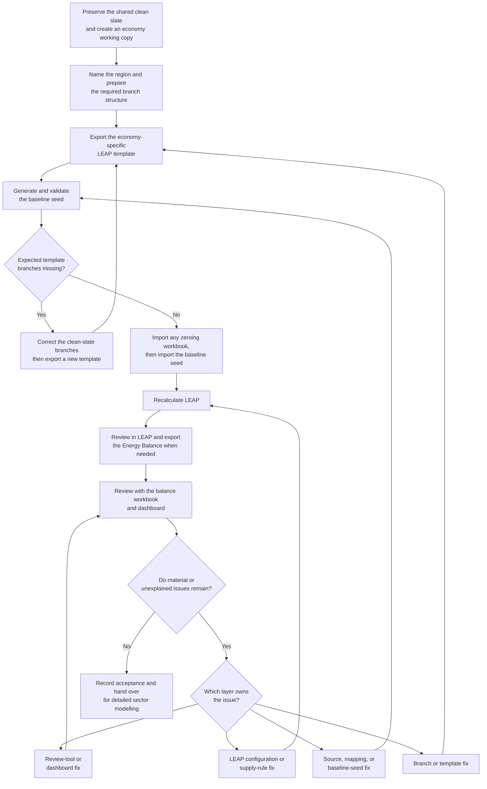

# LEAP economy initialisation guide

**Status:** working first draft, 31 August 2026. This is not yet the operating
authority. Steps marked **Confirm before use** still need an owner or current
operational record. Until this guide is reviewed, follow the maintained guides
linked throughout it when carrying out real work.

**Audience:** economy modellers who need to prepare a clean-slate LEAP area,
load its initial data, review the resulting energy system, and hand it over for
detailed sector modelling.

## What this guide is for

Initialisation turns a shared clean-slate LEAP model into a usable
economy-specific starting point. It brings together three connected activities:

1. preparing the economy area and its branch structure;
2. generating, validating, and importing the baseline seed; and
3. recalculating, reviewing, and correcting the model until its main energy
   pathways are plausible and explainable.

The baseline seed is a structured starting point, not a finished model. It
uses ESTO history, Ninth Outlook projections, canonical mappings, and the
economy's own LEAP export template to populate demand, transformation,
transfers, losses and own use, and Resources. Detailed demand and power models
can replace placeholders later, but only through an explicit handoff that
prevents double counting.

This guide deliberately does not reproduce every transformation formula,
source-mapping rule, code setting, or issue template. Those details change at a
different rate and remain in the specialist references listed at the end.

## What successful initialisation looks like

An economy is ready to move forward when:

- the correct economy area contains one correctly named region;
- its branch structure and transformation order are intentional;
- the baseline seed passed the applicable template, identity, conservation,
  and import-readiness checks;
- the workbook was imported into the intended area and LEAP recalculated
  successfully;
- the base year reproduces the ESTO balance closely at the agreed comparison
  boundaries;
- projection years follow the intended Outlook pathway unless a documented
  modelling reason explains the difference;
- imports, exports, production, transformation activity, and remaining Unmet
  Requirements are plausible and explainable;
- placeholder and detailed branches do not own the same energy twice; and
- every accepted exception, unresolved issue, source identity, and retained
  output has been recorded for the next modeller.

Initialisation does not require every LEAP result to equal the source data
exactly. It requires material differences to be understood and the model to
balance through the intended pathway.

## The complete process at a glance



The review loop does not automatically mean running the Python
`results_update` mode. The normal path is baseline-seed generation, manual LEAP
import, recalculation, and review. The implemented results-update path is
optional, under review, and should be used only when an explicit run plan calls
for it.

## 1. Establish the area and run record

Before changing LEAP, create a short run record containing:

- economy code and APEC-standard economy name;
- clean-slate source area and version;
- name of the economy working copy;
- intended region name and abbreviation;
- scenarios in scope;
- source-data and mapping vintages;
- economy-template identity;
- baseline-seed run label and workbook path; and
- operator, date, and intended review years.

### Preserve the shared clean slate

Never modify the shared clean-slate source in place. Create a clearly named
working copy for the economy. The organisation-controlled storage location and
versioning convention should be confirmed before this section becomes
authoritative; older Word guides name folders that may no longer reflect the
current shared-drive layout.

Do not use a power-only development area as the final clean-slate source. A
sector-development area may contain useful branches, but it does not establish
the authority or completeness of the economy clean slate.

### Use one correctly named region

Rename the existing region; do not create a new one merely to change the
economy. The working area should normally contain one region, named with the
agreed APEC spelling. Region identity matters during branch and workbook
imports. A mismatch can create duplicate regions, send data to the wrong
region, or produce a partial import whose failure is not obvious.

After any branch import, inspect the region list and remove an accidentally
imported extra region only after confirming it is not the intended region.

## 2. Prepare or replace LEAP branches

This step is needed when the shared clean slate lacks an economy requirement or
when a maintained demand, power, or other module must replace a placeholder or
older branch.

1. Identify the exact branch being replaced and the source area that owns the
   replacement.
2. Record the replacement scope before deleting anything.
3. Delete only the branch that will be replaced.
4. Insert the replacement branch into the intended parent branch using LEAP's
   area/branch import procedure.
5. Confirm the intended data, structure, fuels, yearly shapes, and lifecycle
   profiles were imported.
6. Confirm no duplicate region or unexpected sibling branch was created.
7. If the branch is under Transformation, check its position in the module
   order.
8. Recalculate and confirm that the area still runs.

**Confirm before use:** add current screenshots and the exact approved LEAP
branch-import settings from a recent controlled branch replacement. The Word
source demonstrates the process but does not establish that every option shown
is the maintained default.

### Check transformation order as a system setting

Transformation order changes which module sees and responds to a fuel
requirement first. Do not assume that the visually nearest or physically most
obvious source will be selected automatically. Check order together with
Shortfall rules, Surplus rules, capacity limits, and Resources settings.

The detailed and partly empirical ordering guidance remains in
[`supply_reconciliation_workflow_guide.md`](supply_reconciliation_workflow_guide.md)
and the reviewed transformation/supply notes. This guide uses the simpler
operator rule: if the result balances at the wrong module, inspect order and
balancing rules before changing trade values.

## 3. Decide which placeholders remain active

Clean-slate areas can be used before every detailed demand and power model is
ready. The initialisation workflow therefore supports:

- `Demand\All demand aggregated` for source-data demand not yet owned by a
  detailed demand branch;
- `Electricity interim`, `CHP interim`, and `Heat plant interim` before their
  maintained detailed power counterparts are active; and
- `Demand\Other loss and own use` proxy branches when a balance row cannot be
  represented reliably as auxiliary use in one transformation module.

Placeholders are temporary owners, not extra energy. Before generating the
seed, declare which detailed branches are active and remove their source-data
scope from the corresponding placeholder.

For power, standard and interim modules are alternatives. They must not both
contribute to the same total. For demand, the aggregate should carry only the
residual scope not already represented by detailed branches. Validate the
handoff at one signed, fuel-specific comparison boundary:

```text
retained placeholder + active detailed replacements
    approximately equals the independent source expectation
```

Use [`placeholder_branches_and_interim_models.md`](placeholder_branches_and_interim_models.md)
for the maintained ownership and double-counting rules.

## 4. Export the economy-specific LEAP template

The template is the contract between generated values and the target LEAP
area. Export it from the prepared economy area after all required branch fixes.
Do not reuse another economy's IDs or assume that an old full-model export still
represents the current area.

The template must preserve:

- the two-row LEAP preamble and row-2 column headers;
- `Branch Path`, `Variable`, `Scenario`, and `Region`;
- units, scale, and denominator metadata;
- Level columns matching the branch path; and
- the target area's identity metadata.

Generated rows are matched logically on:

```text
(Branch Path, Variable, Scenario, Region)
```

IDs are installation-specific metadata, not portable row keys. A missing or
unresolved path is a template/structure finding to investigate, not permission
to borrow IDs from another economy.

Run a template preflight before a full baseline seed. If an expected non-zero
branch is missing, correct the branch structure and export the template again.
Do not patch a missing structural requirement by editing the final seed alone.

## 5. Generate and validate the baseline seed

The normal seed combines:

- ESTO historical and base-year balances;
- Ninth Outlook Reference and Target projections;
- canonical mappings maintained in `leap_mappings`;
- the economy-specific LEAP template;
- demand and power placeholders for any unowned scope;
- non-power transformation, transfers, losses and own use; and
- Resources-side production and trade settings.

The workflow writes imports as zero in the normal baseline seed so that LEAP
reveals the balancing requirement after recalculation. This is deliberate.
Expected ESTO/Outlook imports remain reference information for review. Do not
“repair” the seed by copying those imports back into it.

Projected exports are normally preserved according to the maintained workflow
rules. Production is represented primarily through Resources Maximum
Production, while non-power transformation output is generally limited through
Exogenous Capacity. Exact estimation and ownership by flow family are recorded
in [`initialisation_flow_estimation_methods.md`](initialisation_flow_estimation_methods.md).

### Run safely

For actual execution, follow the interpreter, run-label, lock, concurrency, and
polling rules in the root `AGENTS.md` and the technical workflow guide. In
particular:

- use an explicit unique run label for retained output;
- use the pinned Windows interpreter;
- do not launch competing runs for the same economy;
- use the bounded parallel runner for multi-economy process parallelism; and
- do not interrupt the long-running workflow to inspect it.

### Treat validation as part of generation

Before describing a workbook as import-ready, review the applicable checks for:

- branch/variable/scenario/region identity;
- unresolved `-1` IDs and unknown non-zero paths;
- duplicate logical keys;
- expression and unit compatibility;
- source preservation and sign conventions;
- conservation across transformation, supply, demand, and own use;
- placeholder/detailed-model overlap; and
- the run's validation and readiness findings.

A missing check artifact means “unknown,” not “passed.” Use
[`check_registry.md`](check_registry.md) and
[`baseline_seed_rule_inventory.md`](baseline_seed_rule_inventory.md) for the
current check authority.

If the run produced a separate zeroing workbook, import it before the main
seed. Reversing the order would erase values the main seed just populated.

## 6. Import the seed and recalculate LEAP

The maintained procedure is a manual workbook import into the declared LEAP
area.

1. Confirm the workbook passed review and belongs to the economy, template,
   scenario set, and run label in the run record.
2. If present, import the zeroing workbook first.
3. Open the main seed in Excel and activate it immediately before the LEAP
   import. LEAP uses the last active Excel workbook.
4. Confirm the intended LEAP area is open.
5. Use **Analysis → Import from Excel Template** and import **Data**.
6. Use name matching for branches, variables, scenarios, and regions rather
   than relying on IDs.
7. Wait for the import to finish. Stop on rejected rows or an unexplained
   warning; do not click through and reconstruct the import from memory.
8. Recalculate LEAP and wait until the calculation finishes.
9. Record the import and calculation result.

An area-name difference warning can be expected in the maintained baseline-seed
workflow, but it is not a blanket instruction to ignore other warnings. See
[`leap_gui_balance_export_dashboard_runbook.md`](leap_gui_balance_export_dashboard_runbook.md)
for the current screenshots, focus rule, and recovery procedure.

## 7. Review the first recalculated model

Start with the largest flows and clearest structural errors. A complete
cell-by-cell comparison is rarely the best first pass.

Check:

- expected zeroes that became non-zero, and expected non-zeroes that vanished;
- final demand and placeholder coverage;
- transformation inputs, outputs, and activity;
- primary production against intended limits;
- imports and exports by fuel;
- positive and negative Unmet Requirements;
- fuel values appearing in the wrong balance item; and
- major differences from the base-year ESTO balance or projected Outlook
  pathway.

Record material differences in PJ and, when useful, percentage terms. Separate
an amount difference from an allocation difference: a fuel total can be close
while appearing under the wrong process or balance item.

### Export a reviewable Energy Balance

When the review needs a workbook or dashboard:

1. close the baseline-seed workbook;
2. create and activate a new blank destination workbook;
3. open LEAP Energy Balance for the declared scenario;
4. use fuel columns, Joule-family units (preferably PJ), and at least Level 2
   sector detail;
5. export **All** years, not only the current table;
6. verify the area, scenario, years, units, and indented child rows in the
   exported workbook; and
7. run the balance-review workbook/dashboard flow and retain its archive.

Do not export into the seed workbook and then try to recover the result by
copying sheets. The exact operator procedure is maintained in the GUI runbook
linked above.

## 8. Route each problem to the layer that owns it

| Symptom | First place to investigate | Repeat from |
|---|---|---|
| Expected branch or fuel is absent from the template | Clean-slate branch structure and canonical mapping coverage | Branch fix and template export |
| Template contains the path but the seed omits or misstates it | Source data, mapping, ownership, seed-generation code, or validation exception | Baseline-seed generation |
| Seed imported correctly but LEAP balances at the wrong supply route | Transformation order, Shortfall/Surplus rules, Resources settings, capacity, and production limits | LEAP recalculation |
| LEAP export is wrong-area, wrong-scenario, Level 1, or incomplete | LEAP/Excel export procedure | Energy Balance export |
| Export is valid but review output is missing or misrouted | Review tool, dashboard mappings, or prepared runtime | Review generation |

Do not use a downstream manual correction to hide an upstream defect. A
dashboard issue should not change LEAP; a LEAP rule problem should not be
patched into source data; a missing branch should not be “fixed” by borrowing
another economy's template identity.

## 9. Adjust supply and transformation rules carefully

LEAP passes fuel requirements from demand through Transformation toward
Resources. Several routes can sometimes supply the same fuel. The modeller's
job is to constrain those routes so that balancing occurs at a plausible point,
then use the Energy Balance to verify the outcome.

The following are working APERC defaults, not a formal description of LEAP's
internal algorithm:

| Setting | Working default | Main reason | Important exception |
|---|---|---|---|
| Transformation Shortfall Rule | `RequirementsRemainUnmet` | Avoids an intermediate module importing before intended upstream or Resources supply can respond | Use `ImportToMeetShortfall` only when that module is intentionally the import-backed route |
| Transformation Surplus Rule | `SurplusAvailable` | Leaves output available to the domestic fuel pool | Use `SurplusExported` for a reviewed export-oriented surplus; use `SurplusWasted` only for a real physical loss |
| Resources Unmet Requirements | `MeetWithImports` for tradable fuels | Makes Resources the final balancing point after domestic routes | Keep a deliberate residual or constraint for a confirmed non-tradable or specially modelled fuel |

Apply these settings with the fuel pathway, module order, Maximum Production,
Exogenous Capacity, and trade assumptions in view. Do not change all candidate
rules at once.

For each test:

1. state economy, scenario, year, fuel, branch, and observed result;
2. record imports, exports, production, transformation input/output, and Unmet
   Requirements before the change;
3. change one rule or ordering decision;
4. recalculate;
5. record the same measures after the change; and
6. decide whether the requirement moved to the intended route, rather than
   judging success only because imports or Unmet Requirements fell.

The reviewed Natural Gas and Australia LPG examples support this diagnostic
method, but their observed behaviour should not be generalized into a universal
LEAP algorithm without a controlled reproduction. In particular, the source
documents contain unresolved comments about Surplus behaviour and export
interactions. Present those as working guidance until they are independently
confirmed.

## 10. Decide whether another loop is needed

If a material issue remains, repeat only from the stage that owns it:

- branch fix → export a new template → regenerate the seed;
- source/mapping/seed fix → regenerate and revalidate the seed;
- LEAP configuration fix → recalculate and review;
- export error → export the Energy Balance again; or
- review-tool error → regenerate the review output from the valid export.

The Python `results_update` mode is a separate optional path. It can read real
LEAP balances and propose changes to production or transformation capacity, but
it is under review and may be deactivated. Do not present it as the automatic
next step after every first-pass review. Use it only under an explicit run plan
and retain its gap, cap, convergence, conservation, and readiness evidence.

## 11. Accept and hand over the area

Before handover, confirm the success conditions at the beginning of this guide
and retain:

- the clean-slate source and economy working-area identities;
- the exact economy template;
- source-data and mapping vintages;
- run label, seed workbook, and validation outputs;
- LEAP import/calculation result;
- balance export and review archive, if produced;
- accepted exceptions and their evidence;
- unresolved issues, owner, status, and next action; and
- the declared ownership of every remaining placeholder.

When a detailed demand or power model is introduced, treat that as a controlled
replacement. Remove the equivalent source scope from the placeholder, check the
combined boundary, and retire the placeholder only when its intended scope is
fully covered.

## Material intentionally kept outside this guide

The reviewed Word documents contain useful material that should remain in
specialist references rather than expanding this operator guide:

- detailed power, refining, other-transformation, transfer, and own-use
  methodology;
- the complete list of transformation modules and process-specific formulas;
- implementation flags and preset internals;
- reusable contribution, issue, and resource-record templates;
- historical “missing branches and issues tracker” examples; and
- exploratory explanations of LEAP's opaque internal ordering behaviour.

The main guide should summarize the decision a modeller must make, then link to
the maintained technical or issue reference.

## Open verification before this becomes authoritative

- Confirm the current shared-drive clean-slate location, naming convention,
  archive rule, and owner.
- Record a recent controlled example of creating an economy copy and importing
  a replacement branch.
- Confirm the exact approved branch-import option set and transformation-order
  convention.
- Replace generic template-export wording with the current step-by-step LEAP
  procedure and screenshots.
- Confirm which source-data vintage and base year the published guide should
  name, or keep both configuration-driven.
- Reproduce the Shortfall, Surplus, and export-interaction examples with retained
  before/after balances and promote only confirmed findings.
- Decide whether the rule-adjustment guide remains a living companion or its
  stable content is absorbed here.
- Name the human review and sign-off owner for each economy.

## Maintained references

- [`process_map_human.md`](process_map_human.md) - plain-language Python-side
  process and acceptance concept.
- [`handover/supply_reconciliation_guide.md`](handover/supply_reconciliation_guide.md) -
  current reader-facing operating guide for seed generation.
- [`supply_reconciliation_workflow_guide.md`](supply_reconciliation_workflow_guide.md) -
  detailed workflow, run modes, balancing rules, and diagnostics.
- [`initialisation_flow_estimation_methods.md`](initialisation_flow_estimation_methods.md) -
  source and estimation method for every flow family.
- [`placeholder_branches_and_interim_models.md`](placeholder_branches_and_interim_models.md) -
  placeholder ownership, replacement, and double-counting rules.
- [`leap_gui_balance_export_dashboard_runbook.md`](leap_gui_balance_export_dashboard_runbook.md) -
  current LEAP import, Energy Balance export, and review-app procedure.
- [`check_registry.md`](check_registry.md) and
  [`baseline_seed_rule_inventory.md`](baseline_seed_rule_inventory.md) -
  validation authority.
- [`special_rules_and_design_decisions.md`](special_rules_and_design_decisions.md) -
  accepted decisions and unresolved modelling questions.
- `C:\Users\Work\github\leap_mappings\docs\mappings_system.md` - canonical
  mapping-system authority.

## First source-review record

This draft was shaped by three working Word documents supplied on 31 August
2026:

- *Transformation and supply guide*;
- *Guideline on supply rule adjustment on the LEAP clean slate of each
  economy*; and
- *LEAP initialisation guide*.

They were treated as source evidence, not as executable instructions. Their
unique clean-slate and branch-import material was brought into the main flow;
their rule-adjustment content was condensed into a review chapter; and their
specialist methodology was routed to maintained references. Claims that
conflict with current repository status, contain unresolved reviewer comments,
or describe optional results-update behaviour as routine were not promoted to
authoritative instructions.
