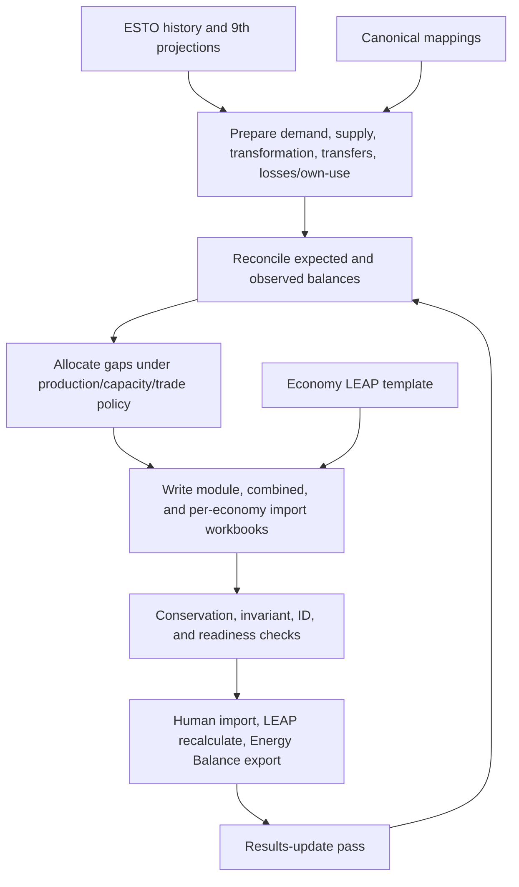

# Supply reconciliation and LEAP initialisation guide

**Verified:** 2026-07-28

**Audience:** analysts, modellers, and maintainers

**Authority:** Level 1 operating guide for LEAP initialisation and supply
reconciliation

**Use this when:** preparing, validating, importing, or iterating LEAP seed and
update workbooks. For cross-repository routing, start at
[`leap_mappings/docs/start_here.md`](../../../leap_mappings/docs/start_here.md).

This guide is the reader-friendly handover route. The full rule and workflow
reference remains
[`../supply_reconciliation_workflow_guide.md`](../supply_reconciliation_workflow_guide.md);
validation ownership remains in [`../check_registry.md`](../check_registry.md).

## Purpose and repository boundary

This repository prepares historical and projected energy data for LEAP,
reconciles recalculated LEAP results against expected supply balances, and
creates import workbooks that preserve the target LEAP area’s identities.

Mapping meaning belongs to the sibling `leap_mappings` repository. This
repository consumes `outlook_mappings_master.xlsx`; it does not redefine
LEAP/ESTO/9th relationships. Dashboard presentation belongs to
`leap_dashboard`.

## End-to-end loop



Python generation and live LEAP interaction are separate. The normal method is
a manual import/recalculate/export loop; COM/API helpers are Windows-only and
are not the default orchestration boundary.

## Main workflow and supporting producers

`codebase/supply_reconciliation_workflow.py` orchestrates:

| Producer | Responsibility |
|---|---|
| `supply_data_pipeline` / `supply_workflow.py` | domestic production, imports, exports, resources-side workbooks |
| `transformation_workflow.py` | transformation inputs/outputs, capacity, efficiency |
| `transfers_workflow.py` | upstream liquids, refining/blending, and unallocated transfers |
| `electricity_heat_interim_workflow.py` | temporary electricity, CHP, and heat modules before the real power model is active |
| `other_loss_own_use_proxy_workflow.py` | proxy activity/intensity for losses and energy-sector own use |
| `aggregated_demand_workflow.py` | temporary aggregate demand branches where detailed LEAP demand is unavailable |
| `functions/patch_baseline_seeds.py` | reviewed module replacement in an existing seed |

The orchestrator is split across `supply_reconciliation_config.py`,
`supply_reconciliation_allocation.py`, `supply_reconciliation_history.py`,
`supply_reconciliation_balance_tables.py`, `supply_reconciliation_results.py`,
and supporting functions. Older descriptions of a 13,000-line monolith are
stale.

## Inputs

| Input | Role | Owner |
|---|---|---|
| ESTO all-economy balance | historical/base-year energy | source data / initialisation copy |
| 9th Outlook all-economy table | Reference/Target projections | source data / initialisation copy |
| canonical mapping workbook | maps source sectors/fuels/flows/products | `leap_mappings` |
| per-economy LEAP export template | branch/variable/scenario/region IDs and metadata | initialisation |
| recalculated LEAP balance exports | observed results for results-update | LEAP operator/initialisation |
| reconciliation config and caps | allocation policy and run behavior | initialisation |
| exception/known-issue configuration | reviewed local validation behavior | initialisation |

Real economies should use their own templates under
`data/leap_export_templates/`. The retired `data/full model export.xlsx` is
not the runtime identity source. Never copy IDs between economies.

## Run modes

| Run mode/pass | Purpose | Important distinction |
|---|---|---|
| `baseline_seed` | build the first complete import seed | uses source targets before reliable recalculated LEAP results exist |
| `results_update` | reconcile after importing/recalculating/exporting LEAP | uses real LEAP balance activity/results |
| `patch_baseline_seeds` | regenerate and replace one verified module slice | not every module has a verified patch-equivalence path |
| compressed projection preflight | exercise source-to-workbook path cheaply | isolated diagnostic, not full production proof |
| compressed results-update preflight | exercise results-update path cheaply | does not replace a genuine LEAP cycle |

## Preparation and balance treatment

Positive transformation values are outputs; negative values are inputs.
Exports and international bunkers remove energy from domestic supply. Loss and
own-use ratios use absolute auxiliary use where appropriate.

| Balance item | Treatment |
|---|---|
| production | `Maximum Production` on primary resources; production headroom is a primary gap-closing lever |
| imports | normally final residual/fallback, deliberately visible as a diagnostic |
| exports | projected/preserved; negative-gap policy can pin exports to 9th |
| bunkers | negative supply-side use |
| stock changes/statistical differences | generated where source rules require; template support can remain an ID gate |
| transformation input/output | signed feedstock/output with capacity and conservation checks |
| transfers | dedicated process modules, not generic imports/exports |
| losses/own use | proxy using source activity for seed, recalculated LEAP activity for update |
| demand | detailed models where available; reviewed aggregate branch fallback elsewhere |

Natural gas is configured as a production-only product in capacity-unmet
allocation: the workflow tries production headroom and does not let a
downstream transformation expansion hide the primary-fuel shortfall.

## Reconciliation and allocation

Reconciliation compares expected supply/balance values with observed or
prepared LEAP values by economy, scenario, product, and year. Allocation then
uses policy in this order/context:

- primary-production headroom;
- eligible transformation capacity unless the product is production-only;
- configured handling of residual positive gaps, normally imports fallback;
- controlled treatment of negative gaps/surplus and exports;
- module/product caps and fixed-technology limits.

Shortfall/surplus rules inside LEAP and transformation ordering also matter.
The usual shortfall pattern is to let requirements remain unmet through
intermediate modules so Resources can supply them, with Resources imports as
the final balance. Widespread `ImportToMeetShortfall` can create premature
imports and conceal domestic-production potential.

Do not hard-code imports as a first fix. Diagnose production, transformation,
capacity, ordering, and shortfall rules first.

## Workbook generation and identity preservation

Generated rows are joined to the economy template using:

```text
(Branch Path, Variable, Scenario, Region)
```

The output preserves:

- `BranchID`, `VariableID`, `ScenarioID`, `RegionID`;
- branch/variable/scenario/region key;
- units, scale, and denominator metadata;
- LEAP expression syntax;
- Level columns;
- the two-row preamble and row-2 headers.

`-1` is an unresolved-ID sentinel. A non-zero row with unresolved IDs is not
safe to import. Zero rows also require review when intended to clear an
existing LEAP value. Conflicting duplicate keys are invalid.

## Outputs

Run-labelled roots are under:

```text
outputs/leap_exports/supply_reconciliation/
  baseline_seed/runs/<label>/
  results_update/runs/<label>/
```

A full run can write:

- per-economy `leap_import_baseline_seed_*.xlsx` or update workbooks;
- a consolidated run workbook;
- yearly/conventional balance tables;
- module workbooks and supporting detail;
- conservation/source-preservation/mapping checks;
- baseline rule findings;
- export-readiness findings and JSON summaries;
- runtime locks, state, timing history, convergence diagnostics, and manifests.

The latest observed three-economy baseline run took 1h 26m 50.9s. The latest
USA readiness summary from that run reports 3,244 blocking findings. This
demonstrates the distinction between successful generation and import
readiness.

## Validation

The canonical check registry separates:

1. enumeration/gap-fill/reset;
2. artifact invariants at the emit boundary;
3. LEAP import readiness;
4. preflight;
5. numeric conservation.

| Evidence | Release meaning |
|---|---|
| blocking readiness finding | do not import |
| warning/review finding | investigate and record decision |
| non-strict conservation warning | workflow can finish, but conservation is not proven |
| missing check file | unknown; not clean |
| zero-row file from a confirmed executed check | no findings for that check/run |

Use the rule inventory for exact SEED rule semantics. Do not duplicate or
paraphrase those rules into ad-hoc lists.

## Economy-specific and aggregate behavior

- Economy codes normally use underscore form in workflow inputs.
- `02_BD` is Brunei Darussalam.
- Real economies require economy-correct region and ID metadata.
- `00_APEC` aggregate runs can use aggregate/no-template fallback behavior and
  must not be treated as proof that each member economy is ready.
- Aggregated-demand generation omits a branch when every selected modelled
  value is zero (`5544853`); absence of that branch is therefore different from
  an unresolved non-zero template path.
- Malaysia results-update needs sufficient Level 2 transformation detail for
  its hydrogen process checks.

## Manual LEAP cycle

1. Generate and review the workbook.
2. Import it into the correct area/scenarios.
3. Recalculate LEAP.
4. Export Results → Energy Balance in PJ, normally Level 2 or higher.
5. Place the export in the resolver’s expected economy directory.
6. Run `results_update`.
7. Inspect balance gaps, caps, convergence, conservation, and readiness.
8. Repeat until remaining gaps are small and explained.

A full LEAP export can take 3–4 hours and should not be interrupted.

## Where mapping semantics are consumed

Initialisation uses the canonical workbook for source-to-LEAP/ESTO/9th
alignment, direct-demand mapping, transformation/supply preparation, and
validation context. If the mapping is wrong, fix `leap_mappings`; if the
correct mapping is applied incorrectly to LEAP variables/IDs, fix this
repository.

## Related reading

- [Supply reconciliation agent guide](supply_reconciliation_agent_guide.md)
- [Full workflow guide](../supply_reconciliation_workflow_guide.md)
- [Check registry](../check_registry.md)
- [Baseline-seed rule inventory](../baseline_seed_rule_inventory.md)
- [Special rules and decisions](../special_rules_and_design_decisions.md)
- `leap_mappings/docs/handover/README.md`
