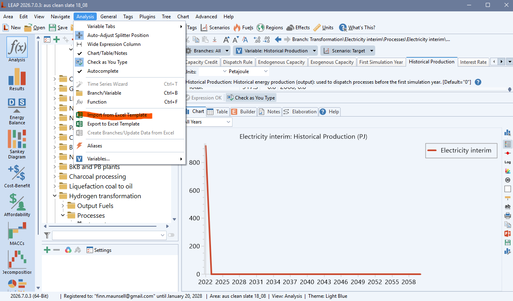
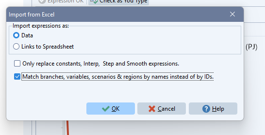
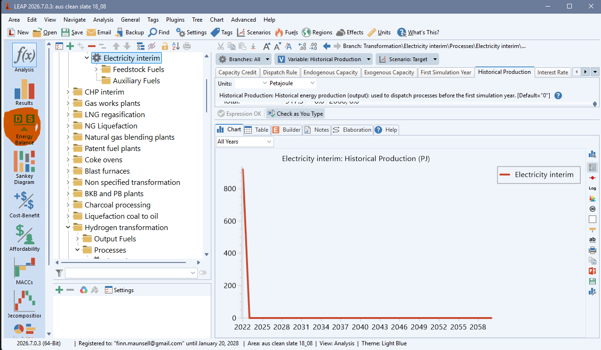
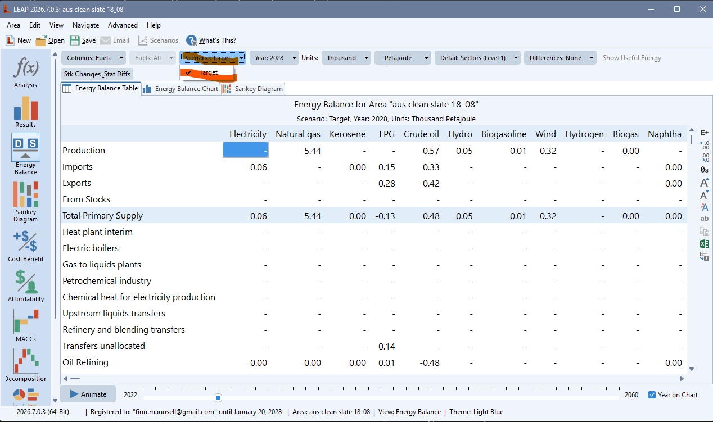
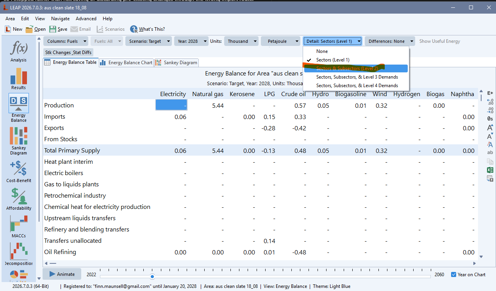
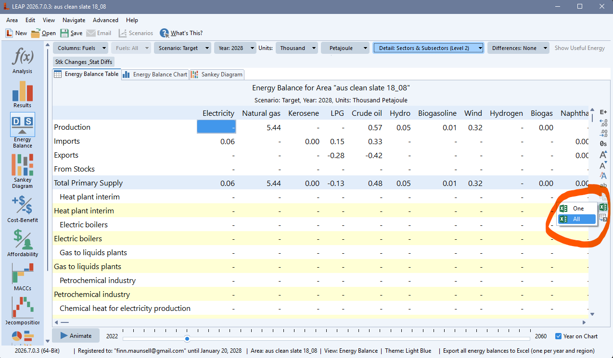
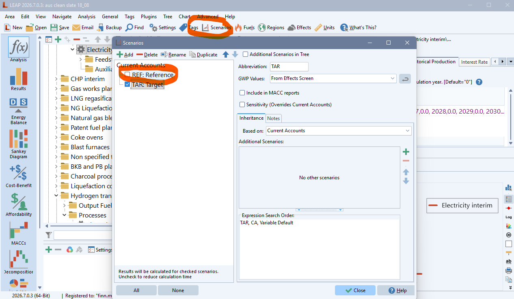

# LEAP GUI balance export and dashboard review runbook

## Purpose

This is the supervised, repeatable route from a completed LEAP-import workbook
to a durable dashboard-review archive. It is written both for an operator and
for a GUI-using agent working beside that operator.

The outcome is one canonical raw LEAP Energy Balance workbook per
economy/scenario, followed by a completed web-review run and a locally saved
ZIP archive. The review app is diagnostic: it does **not** modify the LEAP area.

## Scope and responsibilities

Use a copied/sandbox LEAP area for a new seed or experiment. Do not import into
a colleague's open area or a production area without the model owner's explicit
approval.

The operator must provide or confirm:

- the intended LEAP area and the workbook to import;
- the scenario to export (`Reference` or `Target`);
- the economy code, such as `01_AUS` or `20_USA`;
- the review year(s); and
- approval that the produced export is the one to retain.

A GUI agent may navigate, wait for screens to settle, select the declared
scenario, export, upload, and download. It must stop for the operator if the
visible LEAP area, workbook, scenario, or economy identity differs from the
declared one. It must not guess.

## Naming and storage contract

Store the canonical workbook directly in:

```text
data/leap balances exports/<ECONOMY>/
```

Use this filename, with an ISO date to avoid day/month ambiguity:

```text
full model output all years YYYYMMDD REF.xlsx
full model output all years YYYYMMDD TGT.xlsx
```

For example, an Australia Reference export made on 20 August 2026 is:

```text
data/leap balances exports/01_AUS/full model output all years 20260820 REF.xlsx
```

`REF` is for `Reference`; `TGT` is for `Target`. The resolver scans only files
directly in the economy folder and normally selects the newest recognized date.
Move superseded exports into that economy's `archive/` folder so they cannot be
selected accidentally. See [the raw-export README](../data/leap%20balances%20exports/README.md)
for the full resolver contract.

## Before starting

Record the following in the run log or handover note before touching LEAP:

| Item | Example |
|---|---|
| Economy | `01_AUS` |
| LEAP area shown in the title bar | `aus clean slate 20_08` |
| Imported workbook | `leap_import_baseline_seed_01_AUS_20260820.xlsx` |
| Scenario to export | `Reference` (`REF`) |
| Review year(s) | `2022, 2030, 2040` |
| Export destination | `data/leap balances exports/01_AUS/` |

Close the workbook in Excel before importing it into LEAP. Confirm that no
calculation, import, or export is already running. A stale or half-loaded LEAP
screen is not a safe starting point.

## GUI procedure

### 1. Import the workbook into LEAP

1. Open the declared workbook in Excel **before** starting the LEAP import.
   LEAP discovers the workbook through the open Excel session; do not use
   **Area → Install from File**, which is for a LEAP area rather than a seed
   workbook.
2. Open the declared LEAP area and confirm its name in the title bar or area
   selector against the run log.
3. In LEAP's top navigation, select **Analysis → Import from Excel Template**.

   

4. In **Import from Excel**, choose **Data**. Leave **Only replace constants,
   Interp, Step and Smooth expressions** unchecked. Check **Match branches,
   variables, scenarios & regions by names instead of by IDs**, then select
   **OK**.

   

5. Wait for the import to finish. Do not click through a progress dialog or
   assume a frozen-looking screen has completed.
6. A warning that the workbook and LEAP area names differ is expected for this
   workflow and may be accepted. For any other import error or rejected-row
   message, stop immediately, leave the error visible for the operator, and do
   not attempt a workaround or retry.
7. Recalculate the model if LEAP requires it after the import. Wait until the
   calculation has completed and the interface is responsive.

Success condition: the intended workbook has been accepted into the intended
LEAP area, without an unresolved warning.

### 2. Open and verify Energy Balance

1. Select **Energy Balance** from the left-side results/navigation pane.

   

2. Wait for the table to load fully. A table refresh, spinner, disabled controls,
   or blank data grid means it is still loading.
3. Find the **Details** control. Set it to **Level 2**. If it is already at
   Level 2 or a more detailed setting, leave it there.

   

   In the dropdown, choose **Sectors & Subsectors (Level 2)**.

   

4. Wait again for the balance grid to redraw. Confirm that at least one child
   row is visibly indented beneath a parent row. This is the practical proof of
   `Level 2+` detail.
5. Find the scenario dropdown. Read its current value before changing it. If it
   is not the declared scenario, select the declared scenario and wait for the
   grid to redraw. Re-read the selected value after redraw.

Do not accept **Level 1**. It flattens the balance; downstream review rejects
it because it cannot preserve transformation and own-use detail. The web-app
guide also requires **Columns: Fuels**, not Fuel Groupings, and Energy Balance
units in the Joule family (preferably Petajoules).

Success condition: Energy Balance is loaded, shows indented Level-2-or-deeper
rows, uses fuel columns, and visibly shows the declared scenario.

### 3. Export all Energy Balance years

1. Click the small green Excel/export button on the right side of the Energy
   Balance view, then choose **All** (not **One**). LEAP's status bar describes
   this action as exporting all energy balances to Excel, one sheet per year and
   region.

   

2. Do not export only the current table/year when the dashboard needs a time
   series.
3. In the save dialog, use the filename contract above and save first to a known
   temporary location if LEAP does not allow the final destination directly.
4. Wait until LEAP has completed writing the workbook. Completion means the save
   dialog is closed and the file exists with a stable size; it is not merely that
   the export button became clickable again.
5. Move/copy the completed workbook into its canonical economy folder. Do not
   overwrite a same-date/same-scenario file without checking that it is the
   intended replacement.

Example final path:

```text
data/leap balances exports/01_AUS/full model output all years 20260820 REF.xlsx
```

### 4. Validate the exported workbook before upload

Open the completed file read-only, or let the web app inspect it on upload, and
confirm:

- the title row identifies the expected LEAP area;
- the workbook declares only the intended scenario for this upload;
- the workbook contains the intended years, including the selected review year;
- the units are Petajoules or another supported Joule-family scale; and
- the sheets contain indented child rows, proving `Level 2+` detail.

If any item fails, return to LEAP and re-export. Do not rename a wrong-scenario,
wrong-area, or Level-1 workbook to make it appear valid.

### 5. Run the online balance-review dashboard

1. Open the online LEAP Review Tools web app and, if useful, select its **Guide**
   button. The embedded guide includes screenshots of the export detail and
   fuel-column settings.
2. Upload the workbook. Upload both `REF` and `TGT` exports for the same economy
   when the dashboard needs a Reference/Target toggle; upload one export when
   running a detailed workbook review for one scenario.
3. Read the upload summary. Confirm the inferred economy, LEAP area, scenario,
   units, available years, and `Level 2+` detail. Supply an economy override
   only when the app reports that the area name is ambiguous or unknown.
4. Enter the agreed review year or comma-separated years, for example
   `2022, 2030, 2040`.
5. Keep **Dashboard** selected. Keep **Workbook** selected when a cell-by-cell
   balance review is also wanted.
6. Start the run and keep the tab open while it runs. The dashboard can take
   several minutes because it builds diagnostic data and many charts. If the
   browser was backgrounded, use the app's refresh control when you return.
7. Wait for the status to state completion and for the Results section to show
   the dashboard link and **Complete run archive (.zip)** download.

Success condition: the app exposes the completed dashboard and archive, with
the expected economy/scenario in the run summary.

### 6. Inspect and archive the result

1. Open the dashboard link and confirm its fixed banner and available pages
   describe the intended economy and scenario(s).
2. Download **Complete run archive (.zip)** and save it in the browser's
   Downloads folder. Keep the supplied filename unless the team has a separate
   archive registry.
3. Confirm the downloaded ZIP exists and opens. It is the durable output: the
   app's saved dashboard views are browser-local convenience copies, retain only
   a small recent history, and are not a backup.
4. Record the final export filename and downloaded archive filename/path in the
   run log.

## Agent execution checklist

Use the following state transitions for a GUI automation. Each transition must
be verified from the visible interface before continuing.

```text
READY
  -> AREA_CONFIRMED
  -> IMPORT_COMPLETE
  -> CALCULATION_COMPLETE
  -> ENERGY_BALANCE_LOADED
  -> LEVEL2_CONFIRMED
  -> SCENARIO_CONFIRMED
  -> EXPORT_STARTED
  -> EXPORT_FILE_STABLE
  -> EXPORT_IDENTITY_CONFIRMED
  -> WEB_UPLOAD_CONFIRMED
  -> WEB_RUN_COMPLETE
  -> ZIP_DOWNLOADED_AND_OPENED
```

Stop and ask the operator at any mismatch, unexpected warning, missing green
export control, unavailable scenario, timeout, changed area name, unsupported
units, or failed Level-2 check. Never proceed by silently choosing the closest
available scenario or exporting a different area.

## Recovery guide

| Symptom | Action |
|---|---|
| Energy Balance remains blank or controls are disabled | Wait; if it does not settle, capture the visible state and ask the operator rather than re-clicking repeatedly. |
| Details is Level 1 | Change to Level 2, wait for redraw, and confirm indented child rows. Re-export if an earlier file was Level 1. |
| Scenario dropdown changes but table has not refreshed | Wait until the grid redraw completes, then read the scenario value again. |
| The intended scenario is absent from Energy Balance | Open the top-toolbar **Scenarios** window and ensure its checkbox is selected. LEAP calculates results only for checked scenarios; close the dialog, wait for calculation, then return to Energy Balance. |
| Web app says area/economy is unknown | Check the LEAP area title and select the explicitly approved economy override. Do not infer from the filename alone. |
| Web app refuses the upload for insufficient detail | Re-export from LEAP at Level 2+; do not bypass the check. |
| Dashboard is not finished after several minutes | Keep the tab open and use the app's refresh control. If it reports failure, save the status/error and ZIP/logs if offered. |
| Completed dashboard later disappears from Saved review | This is expected for browser-local history. Use the downloaded Complete run archive ZIP. |

## Evidence to retain

For a teaching run, retain the input workbook name, exact LEAP area, scenario,
export filename, export folder, app run summary, dashboard URL/title, and ZIP
archive filename. A short screenshot at the Level-2/scenario check and another
at the completed Results panel make the run reproducible without retaining a
screen recording.

## Scenario-calculation setting

If a scenario is missing from the Energy Balance scenario dropdown, open the
top-toolbar **Scenarios** control. Tick the checkbox beside the required
scenario (for example, `REF: Reference` or `TAR: Target`). The dialog states
that results are calculated for checked scenarios; uncheck only when reducing
calculation time is an explicitly approved choice. Close the dialog, let LEAP
calculate, and then return to Energy Balance.


