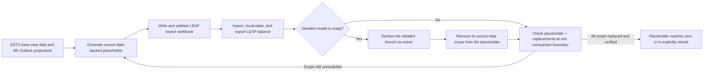

# Placeholder branches and interim models

**Status:** maintained guide

**Audience:** modellers, mapping reviewers, and agents preparing or reviewing
LEAP areas

**Scope:** `All demand aggregated`, `Electricity interim`, `CHP interim`, and
`Heat plant interim`

## Why placeholders exist

A new LEAP area cannot always wait for every detailed demand and transformation
model to be built. It still needs a reasonably complete energy balance so that
imports, exports, production, transformation feedstocks, and other supply
variables can be reconciled.

Placeholders keep the balance represented during that transition. They are
deliberately simpler than the models that will replace them:

- `All demand aggregated` carries demand source data not yet represented by
  detailed demand branches.
- `Electricity interim`, `CHP interim`, and `Heat plant interim` reproduce the
  main signed inputs and outputs of power transformation before the full power
  models are available.

This makes early areas useful for reconciliation and review without pretending
that placeholder values are final model results. A non-zero placeholder tells
the reader which part of the balance is still source-data-backed rather than
endogenously modelled.

## The four maintained placeholder scopes

| Placeholder | LEAP location | What it temporarily represents | Output |
|---|---|---|---|
| `All demand aggregated` | `Demand\All demand aggregated\...` | Demand sectors not yet owned by detailed demand models | Total energy by fuel and, in the maintained layout, demand group |
| `Electricity interim` | `Transformation\Electricity interim\Processes\Electricity interim` | Electricity plants | Electricity |
| `CHP interim` | `Transformation\CHP interim\Processes\CHP interim` | Combined heat and power plants | Electricity and heat |
| `Heat plant interim` | `Transformation\Heat plant interim\Processes\Heat plant interim` | Heat plants | Heat |

There is no maintained **Heat pump interim** module. `09.03 Heat pumps` is a
distinct source flow and must not be silently folded into `Heat plant interim`.
The abbreviation “HP” in this guide means heat plant only when the full name is
also given.

## Placeholder lifecycle



Replacement is a controlled transfer of ownership. It is not achieved by
adding a detailed model on top of an unchanged placeholder, hiding the
placeholder from a chart, or deleting mappings before the combined boundary
has been checked.

## How `All demand aggregated` is created

### Structural handoff

`Demand\All demand aggregated` is the existing container. The maintained
sectorized layout creates six direct children:

```text
Demand
└── All demand aggregated
    ├── Road
    ├── Transport non road
    ├── International transport
    ├── Industry
    ├── Other sector
    └── Buildings
```

Fuel leaves are direct children of those six branches. The exact paths and
spellings are maintained in
[`leap_all_demand_aggregated_fuels_by_sector.csv`](leap_all_demand_aggregated_fuels_by_sector.csv).
Do not create extra aggregate fuel branches such as `Coal`, `Gas`, or
`Biomass`.

| LEAP sector branch | Fuel leaves |
|---|---:|
| Road | 9 |
| Transport non road | 26 |
| International transport | 15 |
| Industry | 49 |
| Other sector | 33 |
| Buildings | 37 |
| **Total branch/fuel rows** | **169** |

The CSV is the current structural handoff, not proof that every source mapping
has been accepted. For a structure-only task, create the branches with the CSV
spellings and do not enter expressions, scenarios, or values manually.

### Value generation

`codebase/aggregated_demand_workflow.py` creates the values separately:

1. it reads historical/base-year demand from ESTO and projections from the 9th
   Outlook;
2. it uses canonical source-to-LEAP fuel mappings from `leap_mappings`;
3. it excludes own use and transmission/distribution losses when the separate
   proxy owns those values;
4. it excludes the **source-data sectors** represented by any detailed demand
   group declared active, so the placeholder remains a residual;
5. it writes LEAP-importable `Total Energy` rows and can add a diagnostic
   `Contributions` sheet;
6. it omits branches that are zero in every requested scenario and year, then
   completes the requested scenario/year grid for the retained branches.

The current supply-reconciliation setting uses sector branches. The workflow
also supports a legacy flat path
`Demand\All demand aggregated\{fuel}`, but new structure work should follow the
maintained sectorized layout unless the configuration is intentionally changed.

The important ownership rule is that detailed LEAP results are **not**
subtracted from the placeholder. Instead, the equivalent ESTO/9th source scope
is excluded when a detailed demand group is activated. This keeps the
placeholder independent of how the detailed model later evolves.

## How the power interim modules are created

`codebase/electricity_heat_interim_workflow.py` builds all three modules into
one workbook per economy:

| Module | 9th Outlook sector | ESTO flows | Allowed positive outputs |
|---|---|---|---|
| `Electricity interim` | `09_01_electricity_plants` | `09.01.01`, `09.02.01` Electricity plants | Electricity |
| `CHP interim` | `09_02_chp_plants` | `09.01.02`, `09.02.02` CHP plants | Electricity and heat |
| `Heat plant interim` | `09_x_heat_plants` | `09.01.03`, `09.02.03` Heat plants | Heat |

The workflow:

- uses positive signed `09_*` transformation values as outputs and negative
  values as feedstocks;
- prohibits the `18_*` and `19_*` output-accounting sectors as transformation
  inputs;
- excludes auxiliary fuel use because own use and losses are handled by the
  separate proxy workflow;
- preserves real source-product detail when creating LEAP feedstock leaves;
- calculates feedstock shares, output, efficiency, historical production, and
  exogenous capacity;
- writes a zero skeleton when an expected module has no usable input/output
  balance.

`RUN_ELECTRICITY_HEAT_INTERIM=True` enables these modules for a baseline seed.
It should be `False` once the full power model owns the same scope. Interim
modules use exogenous capacity; the capacity-unmet logic cannot grow that
capacity, so unresolved supply gaps fall through to the configured import
fallback.

## The mapping contract for placeholders

Mappings explain semantic equivalence; they are not just spelling lookups.
Placeholder mappings must let a person or agent answer four questions:

1. Which source flow/product or sector/fuel does this LEAP branch represent?
2. Is the placeholder a residual component, a full substitute, or a
   deliberately coarser comparison boundary?
3. Which detailed branch takes ownership when the placeholder is replaced?
4. At what common boundary can the placeholder and its replacements be checked
   without double counting?

### Rules for mapping and review

1. **Maintain mapping meaning in `leap_mappings`.** Do not repair a semantic
   mapping in initialisation code or dashboard configuration. The canonical
   workbook, rollup rules, and Common ESTO structure belong in the sibling
   repository.
2. **Map both axes deliberately.** Infer the branch/sector-to-flow axis and the
   fuel-to-product axis independently. A plausible fuel match does not prove
   the branch maps to the right balance flow.
3. **Treat standard and interim power branches as alternatives.** The canonical
   `config/source_branch_fallback_rules.csv` pairs Electricity Generation with
   Electricity interim, CHP plants with CHP interim, and Heat plants with Heat
   plant interim. When both are non-zero, current comparison conversion warns
   and zeros the interim branch in working data; raw parsed input is preserved.
4. **Treat aggregated demand as a residual, not a simple alias.** The canonical
   `config/all_demand_aggregated_components.json` declares which demand groups
   remain inside the aggregate. It warns about overlap and does not
   automatically zero either side. Initialisation prevents overlap by excluding
   the equivalent source sectors when detailed branches are activated.
5. **Do not add alternatives at an additive frontier.** A standard branch and
   its interim substitute must not both contribute to the same power total.
   Likewise, demand represented in a detailed branch must be removed from the
   aggregate's source scope.
6. **Review hierarchy and cardinality together.** Before accepting a mapping,
   inspect parent/child sibling coverage, subtotal status, rollup boundary, and
   raw and after-rollup many-to-many relationships. Do not fix a hierarchy
   mismatch by silently duplicating an aggregate value across children.
7. **Keep only believed-correct maintained rows.** Rejected relationships are
   removed from maintained mapping sheets; their review history belongs in QA,
   notes, or Git history.
8. **Retire in order.** Activate and verify the detailed model, update ownership
   configuration, rerun mapping and balance checks, then remove obsolete
   placeholder structure or mappings only when no supported consumer needs
   them.

For the complete mapping design, maintenance loop, rollup rules, and review
criteria, use the sibling repository's
[`docs/start_here.md`](../../leap_mappings/docs/start_here.md),
[`docs/mappings_system.md`](../../leap_mappings/docs/mappings_system.md), and
[`docs/special_rules_and_design_decisions.md`](../../leap_mappings/docs/special_rules_and_design_decisions.md).
Those documents remain authoritative as the broader mapping guidance is
strengthened; this section states only the placeholder-specific contract.

## Preventing double counting

The two placeholder families use different mechanisms:

| Family | Ownership declaration | Overlap behaviour |
|---|---|---|
| Power interim | `source_branch_fallback_rules.csv` in `leap_mappings` | Standard/interim pairs are non-additive alternatives; current conversion warns and zeros interim working rows when both are active |
| Aggregated demand | `all_demand_aggregated_components.json` in `leap_mappings`, plus `DETAILED_DEMAND_BRANCHES_ACTIVE` in initialisation | The corresponding ESTO/9th source sectors are excluded from the generated residual; overlap is warned about rather than blindly zeroed |

Neither mechanism by itself proves that the replacement values match the
independent source expectation. Validation must check the combined boundary:

```text
observed group = retained placeholder + sum(active replacement branches)
observed group ≈ source expectation at the same boundary
```

For transformations, inputs and outputs must be checked separately. A net
total can conceal an input error offset by an output error. See
[`baseline_seed_balance_diagnostics.md`](baseline_seed_balance_diagnostics.md)
for the diagnostic contract.

## Human and agent checklist

Before generating a placeholder:

- confirm which detailed demand or power models are actually present;
- confirm the selected economy template contains the required branch paths and
  valid IDs;
- set the placeholder and proxy toggles consistently;
- confirm the canonical mappings and ownership declarations cover the intended
  source scope.

Before importing:

- inspect the workbook's LEAP and viewing sheets;
- review unmapped fuels, missing branches, duplicate logical keys, and invalid
  IDs;
- confirm own use and losses are owned once;
- confirm standard and interim power modules are not both being imported.

Before retiring a placeholder:

- rerun the mapping pipeline after reviewed mapping changes;
- compare placeholder plus replacement branches at the same signed,
  fuel-specific boundary;
- verify the detailed model covers every intended sibling/component;
- update dashboard notes only after the underlying ownership and values change;
- preserve the decision and evidence in maintained documentation or Git.

## Provenance

This guide combines and supersedes:

- `docs/colleague_intro_all_demand_aggregated.md`: project context, the
  colleague-facing structure task, and the six-branch overview;
- `docs/leap_all_demand_aggregated_branch_guide.md`: exact paths, naming rules,
  the 169-row fuel-count check, and the separation of branch creation from data
  population.

The originals are preserved under
[`archive/placeholder_guides_20260728/`](archive/placeholder_guides_20260728/).
The broader placeholder purpose, lifecycle, interim-module behaviour, mapping
rules, and replacement checks were verified against the maintained workflows,
configuration, canonical mapping declarations, and balance-diagnostic guide on
2026-07-28.
