# Process map — agent-facing (technical)

**Written 2026-07-23. Verified against the code in this repo at that date.
Re-verify before trusting this after further changes** — this repo iterates
fast (see `docs/current_execution_roadmap.md` and
`docs/prompts/initialisation_refactor_continuation.md`), and every extracted
module and line number cited below can move. Where the older docs
(`docs/system_overview_for_rewrite.md`, 2026-07-17;
`docs/workflow_inventory.md`, 2026-07-07) disagree with what is written here,
this document is the corrected version — the discrepancy is not called out
line by line, the correct current behaviour is just stated directly.

This is the technical companion to `docs/process_map_human.md`. It exists so
a coding agent picking up this repo cold can find, in one place: which file
owns which stage, what each stage reads and writes, and where the extracted
Phase 4 modules sit relative to the original monolith.

## 0. Where to actually start reading

1. `codebase/supply_reconciliation_workflow.py` — the notebook-safe entry
   point. As of 2026-07-23 it is 1,494 lines (re-measure with `wc -l` before
   citing this number elsewhere — it grows every session). It is a thin
   orchestration/config-broadcast wrapper now, not the engine.
2. `codebase/functions/supply_results_saver.py` (4,429 lines) — the actual
   engine. `run_results_linked_transformation_supply_workflow` (line 3106) is
   the single function that runs the whole per-run pipeline described below.
3. `codebase/supply_reconciliation_config.py` — every config constant and
   preset-relevant sentinel (`_ModuleCapRule`, `_resolve_module_cap_rule`,
   etc.). The workflow wrapper does `from codebase.supply_reconciliation_config
   import *` (`supply_reconciliation_workflow.py:65`), and every extracted
   module does the same, which is why "deliver a preset value to every
   consumer" needed its own explicit broadcast mechanism (§4).

## 1. Module map (Phase 4 split — current, not the pre-refactor monolith)

The AGENTS.md phase table and the original `system_overview_for_rewrite.md`
"Current Code Areas" section describe an earlier, less-split state. The
current decomposition (per `docs/current_execution_roadmap.md`, T3/T4/T7 in
`docs/prompts/initialisation_refactor_continuation.md`) is:

| Module | LOC (2026-07-23, re-measure before citing) | Role |
|---|---|---|
| `codebase/supply_reconciliation_workflow.py` | 1,494 | Notebook entry point: presets, `ECONOMIES`/`SCENARIOS` scope, preset broadcast (`_broadcast_preset_overrides`), preflight orchestration, calls into `supply_results_saver`. |
| `codebase/supply_reconciliation_allocation.py` | 1,994 | Capacity-unmet iterative allocation ledger: `_run_capacity_unmet_iterative_pass`, `_run_capacity_unmet_iterative_balanced_pass`, `_build_capacity_process_catalog`, `_reset_capacity_unmet_allocation_ledger`. |
| `codebase/supply_reconciliation_history.py` | 784 | Iterative-state persistence: state-key helpers, `_read_capacity_unmet_state` / `_write_capacity_unmet_state`, results-signature comparison so a rerun on identical LEAP results is a detectable no-op. |
| `codebase/functions/supply_reconciliation_tables.py` | 2,034 | Reconciliation-table construction: `build_reconciliation_table`, `build_transformation_balance_table`, `build_transformation_sector_table`, `build_transformation_trade_target_rows`, `prepare_projected_supply_table`, `prepare_supply_primary_table`, `apply_trade_split_between_transformation_and_supply`, `reset_supply_and_transformation_import_export_to_zero` (line 1741 — the F1 reset mechanism). |
| `codebase/functions/supply_results_saver.py` | 4,429 | The engine (§2 below): per-economy export generation loop, LEAP-import fuel catalog, combined-workbook assembly, single-file consolidated workbook, conservation diagnostics. Deliberately not yet split further (D4.3 deferred per the continuation register). |
| `codebase/functions/supply_preflight.py` | 2,126 | F4 preflight family: `run_preflight_compressed_projection`, `run_preflight_compressed_results_update`, reset-scope resolution from the full-model export, source diagnostics. |
| `codebase/functions/parallel_economy_runner.py` | 324 | Outer-loop process-per-economy orchestrator (§6). Not used by the default single-process path. |
| `codebase/functions/supply_leap_io.py` | (not separately measured here) | Per-workflow export→combine→LEAP-import glue: `save_transformation_exports_with_split_targets`, `save_transfer_exports_with_supply_overrides`, `save_combined_supply_transformation_export`, `write_per_economy_combined_workbooks`, `run_results_linked_leap_import`, the `run_*_leap_import` family per sub-workflow. |
| `codebase/functions/supply_demand_mapping.py` | — | Demand-mapping/balance-demand loading helpers: `load_balance_demand_inputs`, `load_direct_leap_demand_inputs`, mapping-status/coverage builders. |
| `codebase/functions/baseline_seed_validation.py` | — | The F2 emit boundary: `prepare_seed_rows_for_write` (line 1780) and its ID/share/duplicate rules (SEED-C001–C030, see `docs/baseline_seed_rule_inventory.md`). |
| `codebase/functions/patch_baseline_seeds.py` | — | Re-patches an existing baseline-seed workbook for one sub-workflow's rows without a full run (`run_patch`, `MODULE_REGISTRY`). Used by `RUN_MODE = "patch_baseline_seeds"`. |

Per-domain producer modules (unchanged in role from the old doc, still called
by `supply_results_saver.py`'s per-economy loop, §2.3):

- `codebase/aggregated_demand_workflow.py` (1,906 LOC)
- `codebase/other_loss_own_use_proxy_workflow.py` (1,788 LOC)
- `codebase/transformation_workflow.py` (754 LOC) — thin wrapper over
  `codebase/functions/transformation_analysis_utils.py`
- `codebase/transfers_workflow.py` (1,364 LOC)
- `codebase/electricity_heat_interim_workflow.py` (1,332 LOC)
- `codebase/hydrogen_transformation_workflow.py` (725 LOC)
- `codebase/old_workflows/refining_workflow.py` (archived; Oil Refining is
  produced by `codebase/transformation_workflow.py`)
- `codebase/supply_workflow.py` (211 LOC) — standalone supply wrapper over
  `codebase/functions/supply_data_pipeline.py`, used directly by the engine's
  per-economy loop via `supply_data_pipeline.generate_supply_exports` rather
  than through this wrapper.

LOC figures are `wc -l` counts taken 2026-07-23 on this checkout; treat them
as a snapshot, not a contract (see `docs/current_execution_roadmap.md`'s own
warning about this exact number drifting commit to commit).

## 2. The pipeline, stage by stage

This is the real sequence executed by
`run_results_linked_transformation_supply_workflow`
(`codebase/functions/supply_results_saver.py:3106`), reconstructed from its
`timer.lap(...)` checkpoints (`WorkflowTimer`, `codebase/utilities/
workflow_common.py`), which double as an accurate, code-verified stage list
because they are what the timing/convergence CSVs key off (see
`docs/current_execution_roadmap.md`'s "Timing and measured optimisation
loop").

```mermaid
flowchart TD
    A["supply_reconciliation_workflow.py<br/>ACTIVE_PRESET, ECONOMIES, SCENARIOS<br/>_broadcast_preset_overrides()"] --> B{"RUN_PREFLIGHT_COMPRESSED_PROJECTION /<br/>RUN_PREFLIGHT_COMPRESSED_RESULTS_UPDATE"}
    B -->|"F4 preflight<br/>supply_preflight.py:1278 / :1852"| C["run_with_config()<br/>-&gt; _run_with_config_locked()<br/>economy_run_locks() acquired"]
    C --> D["run_results_linked_transformation_supply_workflow()<br/>supply_results_saver.py:3106"]

    D --> E1["load_balance_demand_inputs()<br/>supply_demand_mapping.py<br/>reads outputs/leap_results/ balance exports<br/>+ TRANSFORMATION_SUPPLY_CACHE balance_demand_cache"]
    E1 --> E2["load_results_sector_demand_table /<br/>load_results_demand_table<br/>supply_reconciliation_tables.py"]
    E2 --> F["build_transformation_balance_table /<br/>build_transformation_sector_table /<br/>build_transformation_trade_target_rows<br/>supply_reconciliation_tables.py<br/>(reads ESTO CSV + 9th CSV via transformation_workflow /<br/>transformation_analysis_utils)"]
    F --> G["prepare_projected_supply_table /<br/>prepare_supply_primary_table<br/>supply_data_pipeline.py<br/>+ load_leap_constraint_tables (CONSTRAINT_TEMPLATE_PATHS)"]
    G --> H["build_reconciliation_table()<br/>supply_reconciliation_tables.py<br/>-&gt; apply_trade_split_between_transformation_and_supply()"]
    H --> H2{"RUN_RESET_SUPPLY_AND_TRANSFORMATION_IMPORT_EXPORT<br/>+ reset_is_effective()"}
    H2 -->|effective| H3["reset_supply_and_transformation_import_export_to_zero()<br/>supply_reconciliation_tables.py:1741 (F1 reset)"]
    H2 -->|not effective, e.g. workbook mode| H4["[WARN] reset SKIPPED —<br/>see docs/work_queue.md [17]"]
    H3 --> I
    H4 --> I["save_year_balance_tables()<br/>supply_reconciliation_balance_tables.py<br/>-&gt; outputs/balance_tables/"]
    I --> J{"CAPACITY_UNMET_PASS_MODE"}
    J -->|"baseline_seed"| J1["_run_capacity_unmet_iterative_pass /<br/>_balanced_pass, baseline_seed branch:<br/>seed only, imports=0, no residual allocation<br/>supply_reconciliation_allocation.py"]
    J -->|"results_update"| J2["_run_capacity_unmet_iterative_pass /<br/>_balanced_pass: reads LEAP balance CSVs,<br/>allocates positive/negative gaps to<br/>production, transformation capacity,<br/>import fallback per config/supply_reconciliation_config.json<br/>supply_reconciliation_allocation.py"]
    J1 --> K
    J2 --> K["build_supply_overrides()<br/>-&gt; per-economy export loop (_run_one_economy)"]

    K --> L1["supply_data_pipeline.generate_supply_exports()<br/>-&gt; outputs/leap_exports/supply_reconciliation/exports/<br/>supply_leap_imports_{economy}*.xlsx"]
    L1 --> L2["save_transformation_exports_with_split_targets()<br/>supply_leap_io.py<br/>-&gt; transformation_leap_imports_{economy}*.xlsx<br/>(calls transformation_workflow.py + transformation_analysis_utils.py<br/>+ hydrogen_transformation_workflow.py process registry)"]
    L2 --> L3["save_transfer_exports_with_supply_overrides()<br/>-&gt; transfer_leap_imports_{economy}*.xlsx<br/>(calls transfers_workflow.py, TRANSFER_PROCESS_CONFIG)"]
    L3 --> L4{"RUN_ELECTRICITY_HEAT_INTERIM"}
    L4 -->|True| L5["electricity_heat_interim_workflow.build_electricity_heat_interim_rows()<br/>-&gt; electricity_heat_interim_{economy}*.xlsx"]
    L4 -->|False| L6
    L5 --> L6["save_combined_supply_transformation_export()<br/>-&gt; combined_supply_transformation_{economy}*.xlsx"]
    L6 --> L7{"RUN_OTHER_LOSS_OWN_USE_PROXY"}
    L7 -->|True| L8["build_other_loss_own_use_proxy_workbooks_for_results_supply()<br/>other_loss_own_use_proxy_workflow.py<br/>-&gt; supporting_files/other_loss_own_use_proxy/{economy}/"]
    L7 -->|False| L9
    L8 --> L9{"WRITE_AGGREGATED_DEMAND_WORKBOOK<br/>and USE_AGGREGATED_DEMAND_AS_DUMMY"}
    L9 -->|True| L10["build_aggregated_demand_workbooks_for_results_supply()<br/>aggregated_demand_workflow.py<br/>-&gt; aggregated_demand_{economy}*.xlsx"]
    L9 -->|False| M
    L10 --> M["[all per-economy exports complete]<br/>(sequential loop, or ThreadPoolExecutor if<br/>PARALLEL_ECONOMY_WORKERS&gt;1 — guarded to reject &gt;1,<br/>see docs/work_queue.md [17] / T7)"]

    M --> N["_build_transformation_supply_fuel_catalog_df()<br/>supply_results_saver.py<br/>merges LEAP probe rows + data/leap_export_templates/*<br/>+ data/full model export *.xlsx -&gt; fuel_registry.csv"]
    N --> O{"RUN_RESET_SUPPLY_AND_TRANSFORMATION_IMPORT_EXPORT<br/>and NOT effective"}
    O -->|True| O1["build_supply_transformation_zeroing_workbooks()<br/>-&gt; supply_transformation_zeroing_{economy}.xlsx<br/>(template-based reset, import BEFORE the main seed)"]
    O -->|False| P
    O1 --> P{"ZERO_OTHER_DEMAND_BRANCHES_FROM_EXPORT<br/>and USE_AGGREGATED_DEMAND_AS_DUMMY"}
    P -->|True| P1["build_other_demand_zeroing_workbooks()<br/>-&gt; demand_zeroing_{economy}*.xlsx"]
    P -->|False| Q
    P1 --> Q{"include_leap_import<br/>(ANALYSIS_INPUT_WRITE_MODE=='api', decommissioned)"}
    Q -->|False, normal| R
    Q -->|True, dead path| Q1["run_results_linked_leap_import() etc.<br/>-&gt; leap_core.py, LEAP_API_BLOCKED=True raises<br/>(see docs/check_registry.md hotspot 3)"]
    Q1 --> R["write_per_economy_combined_workbooks()<br/>supply_leap_io.py:1663<br/>-&gt; prepare_seed_rows_for_write()<br/>baseline_seed_validation.py:1780 (F2 emit boundary)<br/>-&gt; outputs/leap_exports/supply_reconciliation/baseline_seed/<br/>leap_import_baseline_seed_{economy}_{run_stamp}.xlsx"]
    R --> S{"RESULTS_SINGLE_FILE_OUTPUT"}
    S -->|True| S1["save_results_linked_single_workbook()<br/>supply_results_saver.py:1562<br/>-&gt; outputs/leap_exports/supply_reconciliation/<br/>supply_recon_run_{mode}_{economies}_{scenarios}.xlsx"]
    S -->|False| T
    S1 --> T["diagnostics: balance matching, balance-demand<br/>issue report, source diagnostics<br/>-&gt; supporting_files/checks/"]
```

### 2.1 Stage detail with reads/writes

| Stage | Function / file | Reads | Writes |
|---|---|---|---|
| Preflight | `run_preflight_compressed_projection` (`supply_preflight.py:1278`), `run_preflight_compressed_results_update` (`:1852`) | ESTO CSV, 9th CSV, `data/leap_export_templates/*`, `config/supply_reconciliation_config.json` | `outputs/leap_exports/supply_reconciliation/preflight_compressed_projection/`, `.../preflight_compressed_results_update/` |
| Balance-demand load | `load_balance_demand_inputs` (`supply_demand_mapping.py`) | LEAP balance export workbooks (`LEAP_RESULTS_TABLES_DIR`, see `outputs/leap_results/`), canonical mapping via `codebase/mappings/canonical_mapping.py` (which itself reads `leap_mappings/config/outlook_mappings_master.xlsx` per `codebase/utilities/master_config.py:12`) | `runtime/balance_demand_cache/*.pkl` if `TRANSFORMATION_SUPPLY_CACHE_ENABLED` |
| Transformation/supply table build | `build_transformation_balance_table`, `build_transformation_trade_target_rows`, `prepare_projected_supply_table`, `prepare_supply_primary_table` (`supply_reconciliation_tables.py`, `supply_data_pipeline.py`) | ESTO base table (`data/00APEC_2024_low_with_subtotals.csv`, `workflow_config.ENERGY_SOURCE_ESTO_BASE_TABLE_PATH`, `workflow_config.py:156`), 9th projection table (`data/merged_file_energy_ALL_20251106.csv`, `workflow_config.py:158`), canonical/rollup mapping sheets | `runtime/transform_supply_cache/*.pkl` |
| Reconciliation table | `build_reconciliation_table`, `apply_trade_split_between_transformation_and_supply` (`supply_reconciliation_tables.py`) | in-memory tables above | in-memory `reconciliation_table` (optionally `reconciliation_table.csv` if `RESULTS_WRITE_LEGACY_SIDECAR_FILES`) |
| Reset (F1) | `reset_supply_and_transformation_import_export_to_zero` (`supply_reconciliation_tables.py:1741`) | `reconciliation_table`, `RESET_SCOPE_*` config | zeroed `reconciliation_table` in-memory, and (if not effective) a separate `supply_transformation_zeroing_{economy}.xlsx` workbook later |
| Yearly balance tables | `save_year_balance_tables` (`supply_reconciliation_balance_tables.py`) | `reconciliation_table` | `outputs/balance_tables/` (CSV per year) |
| Capacity-unmet allocation | `_run_capacity_unmet_iterative_pass` / `_run_capacity_unmet_iterative_balanced_pass` (`supply_reconciliation_allocation.py`) | balance CSVs just written, `config/supply_reconciliation_config.json` cap/priority rules, iterative-state JSON (via `supply_reconciliation_history.py`) | updated iterative-state JSON (`runtime/` under the run's output dir), allocation ledger (in-memory, `_reset_capacity_unmet_allocation_ledger`) |
| Per-economy export generation | `_run_one_economy` closure (`supply_results_saver.py:3728`) calling `supply_data_pipeline.generate_supply_exports`, `save_transformation_exports_with_split_targets`, `save_transfer_exports_with_supply_overrides`, `electricity_heat_interim_workflow.build_electricity_heat_interim_rows`, `save_combined_supply_transformation_export`, `build_other_loss_own_use_proxy_workbooks_for_results_supply`, `build_aggregated_demand_workbooks_for_results_supply` | `reconciliation_table`, `transformation_process_records`, `data/leap_export_templates/leap_export_template {economy}.xlsx` | `outputs/leap_exports/supply_reconciliation/exports/*.xlsx` (per sub-workflow + combined), `outputs/leap_exports/supply_reconciliation/supporting_files/other_loss_own_use_proxy/{economy}/` |
| Fuel branch catalog | `_build_transformation_supply_fuel_catalog_df` / `_build_transformation_supply_fuel_catalog` (`supply_results_saver.py`) | `data/leap_export_templates/*`, `data/full model export {date}.xlsx` (most recent), optional live LEAP probe rows | `fuel_registry.csv` under the run's supporting files |
| Zeroing workbooks | `build_supply_transformation_zeroing_workbooks`, `build_other_demand_zeroing_workbooks` (`supply_leap_io.py`) | full-model export template, `RESET_SCOPE_*` | `supply_transformation_zeroing_{economy}.xlsx`, `demand_zeroing_{economy}*.xlsx` — **must be imported into LEAP before** the main seed workbook (see `docs/current_execution_roadmap.md` "[18] zeroing workbooks") |
| Emit boundary / seed assembly | `write_per_economy_combined_workbooks` (`supply_leap_io.py:1663`) → `prepare_seed_rows_for_write` (`baseline_seed_validation.py:1780`) | every per-sub-workflow export path collected above | `outputs/leap_exports/supply_reconciliation/baseline_seed/leap_import_baseline_seed_{economy}_{run_stamp}.xlsx` |
| Consolidated single-file workbook | `save_results_linked_single_workbook` (`supply_results_saver.py:1562`) | `reconciliation_table`, all export paths, `fuel_branch_catalog_df` | `outputs/leap_exports/supply_reconciliation/supply_recon_run_{mode}_{economies}_{scenario-abbrev}.xlsx` — a verification/results-view artifact spanning every economy in the run, **not** a per-economy LEAP import file (its Region/BranchID are not area-correct for every economy; see the `template_path` comment at `supply_results_saver.py:~4204`) |
| Diagnostics | various `write_supply_diagnostic` calls (`supply_results_saver.py`) | `reconciliation_table`, conservation reference builders | `outputs/leap_exports/supply_reconciliation/supporting_files/checks/*.csv` (F5 conservation, balance-matching, balance-demand issue report) |

## 3. Config and mapping sources actually read

| Source | Path | Read by |
|---|---|---|
| ESTO base-year table | `data/00APEC_2024_low_with_subtotals.csv` (`workflow_config.ENERGY_SOURCE_ESTO_BASE_TABLE_PATH`, `codebase/configuration/workflow_config.py:156`) | `aggregated_demand_workflow.py` (`ESTO_BASE_DATA_PATH`, line 64), transformation/supply table builders |
| 9th Outlook projection table | `data/merged_file_energy_ALL_20251106.csv` (`workflow_config.ENERGY_SOURCE_NINTH_PROJECTION_TABLE_PATH`, `workflow_config.py:158`) | `aggregated_demand_workflow.py` (`PROJECTION_DATA_PATH`, line 65), transformation workflow, supply data pipeline |
| Canonical mapping workbook (external repo) | `leap_mappings/config/outlook_mappings_master.xlsx` (`OUTLOOK_MAPPINGS_MASTER_PATH`, `codebase/utilities/master_config.py:12`) | `codebase/mappings/canonical_mapping.py`, `codebase/mappings/canonical_loaders.py`; also invalidates `transform_supply_cache` when its mtime changes (`supply_results_saver.py:3454-3456`) |
| LEAP export templates (per economy) | `data/leap_export_templates/leap_export_template {economy}.xlsx` (e.g. `leap_export_template 01_AUS.xlsx`) | fuel branch catalog, per-economy ID enrichment in `write_per_economy_combined_workbooks` |
| Full-model export (schema authority) | `data/full model export {DDMMYYYY}.xlsx` (most recent by filename date; several dated copies present, e.g. `full model export 15072026.xlsx`) | `_build_transformation_supply_fuel_catalog_df`, reset-scope resolution (`supply_preflight.py:570`), demand-zeroing branch enumeration |
| Legacy consolidated mapping workbooks | `config/legacy/master_config.xlsx`, `config/legacy/leap_mappings.xlsx` (moved out of `config/` 2026-07-23, `527bf9d`, per T4 in the continuation register) | historical/legacy readers only — do not point new code at these; `config/backup_leap_mappings.xlsx` is a distinct, still-live file |
| Capacity/cap-priority config | `config/supply_reconciliation_config.json` | `supply_reconciliation_allocation.py` (cap rules, priority order) |
| Transfer process grouping | inline `TRANSFER_PROCESS_CONFIG` in `codebase/transfers_workflow.py` (not yet externalised — a known rewrite item) | `transfers_workflow.py` |

Output root taxonomy (`codebase/utilities/output_paths.py:8-19`): `outputs/leap_exports/{standalone,supply_reconciliation,combined}`, `outputs/balance_tables`, `outputs/mappings`, `outputs/leap_results`. Within `outputs/leap_exports/supply_reconciliation/` the live subfolders as of 2026-07-23 are `exports/`, `baseline_seed/`, `results_update/`, `workbooks/`, `combined_everything/`, `supporting_files/` (`checks/`, `runtime/`, `diagnostics/`, `baseline_seed_validation/`, `baseline_seed_comparison/`, `archive/`), plus the per-run-labelled `preflight_compressed_projection/` and `preflight_compressed_results_update/`.

## 4. Preset delivery mechanism (why a plain `globals().update()` is not enough)

Every extracted module (`supply_reconciliation_allocation.py`,
`supply_reconciliation_tables.py`, `supply_preflight.py`, etc.) does
`from codebase.supply_reconciliation_config import *`, taking its own private
copy of every config constant at import time. `ACTIVE_PRESET` in the wrapper
only rebinds the wrapper's own globals. `_broadcast_preset_overrides()`
(`supply_reconciliation_workflow.py:378`) walks `sys.modules` and pushes the
preset dict's values into every already-imported `codebase.*` module that
defines the same name (`_broadcast_config_overrides`,
`supply_preflight.py`), which is why a preset change is not "just edit a
dict" — see `docs/work_queue.md` [17] and T1 in
`docs/prompts/initialisation_refactor_continuation.md` for the defect this
mechanism itself had until 2026-07-21 (a delivered flag whose *effect* was
gated off, silently, in workbook mode).

Two presets exist at the bottom of the wrapper file
(`supply_reconciliation_workflow.py:878` `_PRESET_BASELINE_SEED`, `:1022`
`_PRESET_RESULTS_UPDATE`), plus `_PRESET_PATCH_BASELINE_SEEDS` (`:986`) for
the `RUN_MODE = "patch_baseline_seeds"` short-circuit that skips the full
workflow and calls `patch_baseline_seeds.run_patch()` directly. `ACTIVE_PRESET`
(`:1078`) selects which one runs; `ECONOMIES` / `SCENARIOS` (`:825`, `:840`)
are edited separately per run.

## 5. Parallelism — two different mechanisms, do not confuse them

1. **In-process thread pool for per-economy export generation**
   (`supply_results_saver.py:3904-3917`, `PARALLEL_ECONOMY_WORKERS`). Guarded
   to reject values `> 1`
   (`_resolve_parallel_economy_workers`, `supply_results_saver.py`, pinned by
   `tests/test_parallel_economy_workers_guard.py`) because every extracted
   module's `import *` config copy is shared across threads in one
   interpreter — a value change from one economy's pass could bleed into
   another's mid-run. Default `0`; this path is currently dead by design.
2. **Outer-loop process-per-economy runner**
   (`codebase/functions/parallel_economy_runner.py`,
   `run_economies_in_parallel`). Launches a **separate OS process** per
   economy running `supply_reconciliation_workflow.py` as `__main__`, each
   with an explicit `LEAP_WORKER_SNAPSHOT_JSON` env var consumed by
   `_apply_worker_snapshot_overrides` (`supply_reconciliation_workflow.py:719`)
   before any config resolves. `max_workers` defaults to `1`. Verified
   2026-07-23 (`9aab65b`): sequential equivalence against a known-good
   `01_AUS` baseline (byte-for-byte, 3,432 rows / 0 diffs) and a controlled
   two-economy concurrent smoke test (`01_AUS` + `12_NZ`, zero
   cross-contamination). **Not yet built**: merging more than one economy's
   *combined single-file* workbook into one artifact — each worker's
   per-economy seed workbook is already correct standalone, but the
   consolidated multi-economy file (§2.1 "Consolidated single-file
   workbook") is not reconstructed across workers. See
   `codebase/functions/parallel_economy_merge.py` for the partial piece that
   does exist (merging validation findings/issue-group CSVs across workers).

## 6. Diagnostics / checks — where each family sits in this pipeline

Full taxonomy: `docs/check_registry.md`. Quick map onto the stages above:

- **F1** (gap-fill / reset) — the reset step (§2.1 row "Reset (F1)") and the
  aux-fuel/measure gap-fill inside `transformation_record_builder.py`, invoked
  from within `save_transformation_exports_with_split_targets`.
- **F2** (artifact invariants) — the emit boundary, `prepare_seed_rows_for_write`
  (`baseline_seed_validation.py:1780`), the single mandatory gate every
  baseline-seed and patcher write crosses (§2.1 "Emit boundary").
- **F3** (LEAP-import readiness) — region/scenario checks inside each
  `save_*_exports_*` call and `run_export_readiness`
  (`codebase/utilities/leap_export_readiness.py`).
- **F4** (preflight) — `supply_preflight.py`, run before the main pipeline
  (§2, top of the flowchart).
- **F5** (conservation) — the diagnostic writes near the end of
  `run_results_linked_transformation_supply_workflow` (§2.1 "Diagnostics" row)
  plus `functions/conservation_policy.py`'s `build_with_conservation_policy`
  wrapping every producer's projection-allocation call.

## 7. Known structural traps an agent should not re-discover the hard way

- **The LEAP API is decommissioned.** `LEAP_API_BLOCKED = True`
  (`codebase/functions/leap_api_guard.py`); `connect_to_leap` raises
  (`leap_core.py:202`). `include_leap_import` is derived from
  `ANALYSIS_INPUT_WRITE_MODE == "api"`, which should never be set in normal
  operation — the workbook-import path (manual LEAP import) is the only
  supported route. See `docs/check_registry.md` hotspot 3.
- **The reset is gated on the (dead) LEAP-import fill.**
  `RUN_RESET_SUPPLY_AND_TRANSFORMATION_IMPORT_EXPORT=True` in workbook mode
  now correctly prints `[WARN] ... reset SKIPPED` instead of silently
  zeroing trade columns with nothing to refill them
  (`supply_results_saver.py:3557-3575`, commit `c5401a5`). A log line
  reading `RUN_RESET_...=True (in effect: False)` is expected and correct in
  normal workbook-mode runs — do not "fix" it.
- **Do not diff a raw standalone workflow export against a finished seed.**
  `complete_canonical_share_groups` and the rest of `prepare_seed_rows_for_write`
  only run on paths that cross the F2 boundary (full run, patcher). A raw
  per-workflow export (e.g. running `transformation_workflow.py` alone) will
  show placeholder/all-zero share groups that the seed writer would have
  fixed — always compare post-boundary artifacts on both sides
  (`docs/check_registry.md` § "Emit-boundary path divergence").
- **The transformation-patch gate stays.** `patch_baseline_seeds.py`'s
  simplified `_collect_auto_regen` path for transformation modules is NOT
  equivalent to the real workbook producer
  (`save_transformation_exports_with_split_targets`); a real 12_NZ A/B found
  1,209 dropped rows, 21 invented, 72 changed. `RUN_MODE =
  "patch_baseline_seeds"` with `PATCH_MODULE` including a transformation
  auto-regen sector (`oil_refineries`, `lng`, `hydrogen`, `transformation`, ...)
  raises `NotImplementedError` by design — do not remove that gate without
  re-running the equivalence harness
  (`codebase/scrapbook/transformation_ungate_equivalence_harness.py`).
- **Two live copies of the wrapper module in one process.** Running
  `supply_reconciliation_workflow.py` as a script makes it `__main__`;
  `supply_preflight`'s late import then loads the same file again under
  `codebase.supply_reconciliation_workflow`. Harmless today (both copies
  compute identical values) but relevant if you add new mutable per-run state
  to this module — see T1's "Hazard for T3" note in
  `docs/prompts/initialisation_refactor_continuation.md`.
- **BOM files.** Several core `codebase/*.py` files carry a UTF-8 BOM; read
  as `utf-8-sig` for any AST/grep-style tooling (`leap_core.py` does not have
  one — check per file).

## 8. Automated test coverage for this pipeline (starting points, not exhaustive)

- `tests/test_supply_reconciliation_capacity_unmet_iterative.py`,
  `tests/test_iterative_pass_archive_simulation.py` — capacity-unmet
  allocation and state persistence.
- `tests/test_reconciliation_phase4_characterization.py`,
  `tests/test_reconciliation_state_forwarding.py` — config-surface and
  run-context snapshots for the Phase 4 split; preset-delivery regression
  coverage.
- `tests/test_parallel_economy_workers_guard.py`,
  `tests/test_parallel_economy_runner.py`,
  `tests/test_parallel_economy_worker_snapshot.py`,
  `tests/test_parallel_economy_merge.py` — the two parallelism mechanisms in
  §5.
- `tests/test_conservation_policy.py` — F5 severity policy.
- `tests/test_other_loss_own_use_proxy_workflow.py`,
  `tests/test_hydrogen_transformation_workflow.py`,
  `tests/test_transfers_template_coverage.py` — per-domain producer coverage.
- `tests/test_leap_api_decommissioned.py` — locks the LEAP API off; a
  passing suite with this test failing means someone tried to re-enable a
  dead path.
- `tests/test_convergence_csv_cleanup.py` — Phase 5A run-history manifest and
  pruning.

## 9. Related docs (read next, in this order)

1. `docs/process_map_human.md` — the plain-English companion to this file.
2. `docs/check_registry.md` — full check/validation taxonomy (F1–F5).
3. `docs/current_execution_roadmap.md` — what phase of the refactor is active
   right now and what is explicitly not done yet.
4. `docs/prompts/initialisation_refactor_continuation.md` — the open-thread
   register; check this before assuming any "known issue" above is still
   open.
5. `docs/baseline_seed_rule_inventory.md` — full detail on every SEED-C rule
   enforced at the F2 emit boundary.
6. `docs/archive/supply_side_modelling_overview.md` — what the numbers this
   pipeline produces are supposed to mean *inside LEAP* (not a description of
   this Python pipeline; a companion on the modelling-logic side).
