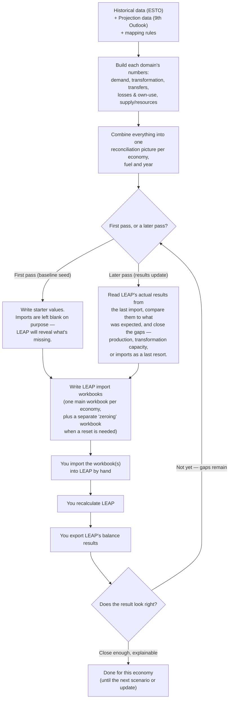

# Process map — for modellers (plain English)

**Written 2026-07-23. This describes how the Python side of the tool works
right now. If you are reading this much later, ask whoever maintains the
code whether anything major has changed — this kind of document goes stale
as the code keeps moving.**

This document explains what the Python tool in this repo actually does, in
plain language, so you can follow the process without reading code. It is
the companion to `docs/process_map_agent.md`, which is the technical version
for a developer. It is also different from
`docs/archive/supply_side_modelling_overview.md`, which explains how LEAP
itself balances fuels once the data is inside it — this document explains
what happens *before* that, in Python, to produce the data LEAP gets fed.

## The one-sentence version

The tool reads historical energy-balance data (ESTO) and a projection
(the 9th Outlook), combines them with the mapping rules that translate that
data into LEAP's branch structure, and writes out spreadsheets ("workbooks")
that you import into LEAP by hand. After you recalculate LEAP and export its
results, the tool reads those results back in and produces an updated set of
workbooks that close whatever gaps showed up. You repeat that loop a few
times per economy until the model looks right.

## Why this loop exists at all

LEAP does not let you "solve" an energy balance directly — you tell it
production limits, transformation capacities, efficiencies, and trade
assumptions, and it works out the consequences (imports, exports, unmet
demand) by passing fuel requirements upstream through the model. Whether
those consequences look sensible depends on the whole system, not any one
branch in isolation. So the practical way to set up a new economy is:
seed it with a first-guess set of values, see what LEAP does with them, and
adjust. This tool exists to make each of those adjustment passes fast and
consistent instead of manual and error-prone.

## The stages, in order

## What each stage means, in more detail

### 1. Read the source data and the mapping rules

Two data sources feed everything:

- **ESTO** — the historical, base-year energy balance for the economy (a
  table of flows and products by year).
- **The 9th Outlook** — the projection data, giving a plausible future path
  for demand and supply by sector and fuel.

Neither of these speaks LEAP's language directly. A separate set of mapping
tables (maintained partly in this repo, partly in a sibling repo called
`leap_mappings`) translates ESTO/9th Outlook codes into LEAP's branch names
and fuel labels. If a mapping is missing or wrong, values can silently fail
to reach the right LEAP branch — this is one of the most common sources of
"why is this number missing" problems.

### 2. Build each domain's numbers separately

The tool is organised by domain, and each domain is built mostly
independently before being combined:

- **Demand** — a simplified, single "aggregated demand" branch per fuel,
  used as a stand-in until the full demand model is ready, or whenever a
  quick demand signal is needed to get supply/transformation initialisation
  moving.
- **Transformation** — processes that convert one fuel into another: gas
  works, coke ovens, blast furnaces, refineries, LNG/gas liquefaction and
  regasification, hydrogen production, and several smaller or
  balance-structure-only sectors.
- **Transfers** — reclassification of fuels between categories (not a
  physical conversion), grouped into a small number of LEAP-friendly
  categories such as upstream liquids transfers and refinery/blending
  transfers.
- **Losses and own-use** — energy the energy sector itself consumes or
  loses (own-use in coal mining, LNG regasification, transmission losses,
  and so on), represented as its own set of demand-like branches where it
  cannot cleanly be folded into a transformation process.
- **Electricity/heat "interim"** — a simplified stand-in for the power
  sector (electricity, CHP, and heat plants) used while the full power model
  is not yet wired in for a given economy.
- **Supply / Resources** — domestic production, imports, and exports for
  every fuel, split into primary resources (crude oil, coal, gas, and so on)
  and secondary fuels (things transformation processes produce, like petrol
  or LNG).

### 3. Combine into one reconciliation picture

All of the above gets lined up against each other, economy by economy, fuel
by fuel, year by year: does what supply and transformation together produce
actually cover what demand, transformation inputs, and losses need? Where it
doesn't, that's the gap the next stage has to decide how to close.

### 4. First pass vs. later passes

The tool runs in one of two modes:

- **Baseline seed (first pass)** — there are no LEAP results yet, so the
  tool writes a first-guess set of values based purely on ESTO and the 9th
  Outlook. Imports are deliberately left blank in this pass: the point is to
  let LEAP tell you, after recalculation, where the model is short.
- **Results update (later pass)** — you have already imported a workbook,
  recalculated LEAP, and exported its balance results. The tool reads those
  results, compares them against what was expected, and works out how to
  close the remaining gap: first by trying domestic production headroom,
  then transformation capacity, and only using imports as a last resort if
  nothing else can close the gap. This choice matters because hard-coding
  imports too early can hide a production or capacity problem that should
  have been fixed instead.

### 5. Write the workbooks

Everything gets packaged into spreadsheets shaped exactly the way LEAP
expects for import — one main "baseline seed" workbook per economy,
plus (when a reset is needed) a separate "zeroing" workbook that clears old
values before the main workbook re-populates them. The order of import
matters: the zeroing workbook always goes in first, otherwise it would wipe
out the values the main workbook just gave you.

### 6. You take over: import, recalculate, export

This part is manual and stays manual by design — direct automated control of
LEAP has been unreliable, so the tool always produces a workbook for you to
import yourself, rather than trying to drive LEAP directly.

1. Import the generated workbook(s) into LEAP, in the stated order.
2. Recalculate the model.
3. Export LEAP's balance results (the actual production, trade, and
   transformation numbers LEAP arrived at).

### 7. Check whether it looks right, and loop if not

After each recalculation, check things like: does final demand look right?
Are transformation outputs (especially power and refining) plausible? Is
production close to the intended path? Are imports/exports explainable? Are
there any "unmet requirements" (LEAP couldn't satisfy something)? If
anything looks wrong, that's a signal to go back to step 4 in
"results update" mode and let the tool propose the next adjustment. This
loop typically runs several times per economy before the numbers are close
enough to trust.

## What "done" looks like

The process is finished for an economy, not when every number matches the
9th Outlook exactly, but when:

- the base year reproduces the ESTO balance closely,
- the near-term projection years stay close to the 9th Outlook path unless
  there's a deliberate reason to diverge,
- remaining gaps are small and can be explained to whoever inherits the
  model, and
- there are no unexplained unmet requirements left in the results.

## A few things worth knowing as a modeller, not just a programmer

- **Two workbooks, one order.** If a "zeroing" workbook is present for an
  economy, it must be imported *before* the main seed workbook, or it will
  wipe out the values you just imported.
- **Some sectors are genuinely just "balance-structure" placeholders.**
  Transfers and a few very small transformation sectors (like
  non-specified transformation) exist mainly to preserve the shape of the
  original ESTO balance table rather than to represent a clean physical
  process. Don't over-interpret their efficiencies or ratios as engineering
  facts.
- **Imports are usually the most useful error signal**, not something to
  fix first. If LEAP is importing more than expected, that's a hint to check
  production limits or transformation capacity before touching the import
  number directly.
- **A run can be per single economy, or can process several economies in
  one go.** Running two economies from the same working copy of the code at
  the same time is currently avoided — the tool is not yet fully set up for
  that without extra care, though a safer path for running economies as
  separate background jobs was added recently.

## Where to go for more detail

- `docs/process_map_agent.md` — the technical version, with real file and
  function names, for whoever maintains the code.
- `docs/archive/supply_side_modelling_overview.md` — how LEAP itself
  balances the fuels once this tool's workbooks are inside it.
- `docs/check_registry.md` — the full list of automatic checks the tool runs
  on its own output before you ever see it, for anyone who wants the detail.

