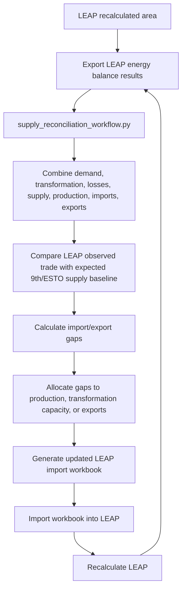

# `supply_reconciliation_workflow.py` Guide

> **Purpose note**  
> This document explains the role of `codebase/supply_reconciliation_workflow.py` in the APERC LEAP workflow. It focuses on the process around the script: why it is needed, how it fits around LEAP, what it compares, and how modellers should interpret its outputs.

This guide is based on the documented workflow logic. It should be checked against the current Python file before being treated as a complete code reference.

## Contents

### Overview

- [0. Where this fits in](#0-where-this-fits-in)
- [1. Why this workflow exists](#1-why-this-workflow-exists)

### How it works

- [2. What the workflow does conceptually](#2-what-the-workflow-does-conceptually)
- [3. The main error signal](#3-the-main-error-signal)
- [4. Active mode: `capacity_unmet_iterative_balanced`](#4-active-mode-capacity_unmet_iterative_balanced)
- [6. Why production and transformation are linked](#6-why-production-and-transformation-are-linked)

### Reference

- [5. Main LEAP variables affected](#5-main-leap-variables-affected)
- [7. Expected inputs](#7-expected-inputs)
  - [Source data files](#source-data-files)
- [8. Expected outputs](#8-expected-outputs)

### Running the workflow

- [9. Manual run loop](#9-manual-run-loop)
- [10. Why the LEAP API is not used as the main method](#10-why-the-leap-api-is-not-used-as-the-main-method)
- [11. How many iterations are expected](#11-how-many-iterations-are-expected)

### Interpreting results

- [12. How to interpret the reconciliation results](#12-how-to-interpret-the-reconciliation-results)
  - [Large positive import gap](#large-positive-import-gap)
  - [Large negative import gap](#large-negative-import-gap)
  - [Large export gap](#large-export-gap)
  - [Unmet requirements](#unmet-requirements)

### Guidelines

- [13. What not to do](#13-what-not-to-do)
- [14. Practical checklist before running](#14-practical-checklist-before-running)
- [15. Practical checklist after running](#15-practical-checklist-after-running)
- [16. When the process is finished](#16-when-the-process-is-finished)

### Code reference

- [17. Code reference](#17-code-reference)

---

## 0. Where this fits in

This workflow is one tool used during the **LEAP initialisation process** — the stage where a new economy/scenario area is first built up and reconciled before it is handed over for scenario work within LEAP. `LEAP initialisation guide.docx` is the overall guide to that initialisation process; it explains where this workflow (and the other initialisation steps, including demand and power) fit in the sequence. Read that guide first for the end-to-end picture; this document only covers the supply/transformation reconciliation step.

The data this workflow reconciles against, and the modelling logic it is trying to keep consistent with, is described in `supply_side_modelling_overview.md`. That document explains the LEAP-side modelling logic (transformation modules, transfers, supply/resources, losses and own-use); this guide explains the Python tool that helps reconcile those branches against expected supply/trade outcomes.

**Sector scope — important limitation.** This workflow can only initialise and adjust the sectors covered by `supply_side_modelling_overview.md`: other transformation (LNG regasification, natural gas liquefaction, coal transformation, blast furnace gas, coke ovens, patent fuel plants, non-specified transformation, etc.), transfers, supply/resources (production, imports, exports), and losses/own-use. This is because those are the only branches this codebase builds workbooks for.

- **Demand** and **Power** are initialised by separate workflows/processes (not this one) — this workflow writes placeholder/zero rows for those branches where needed, but does not set them up.
- **Refining** is a special case: this workflow does perform the *initialisation* of refining (it is part of the same transformation/transfers codebase), but any *adjustments* to refining assumptions after that initial setup (capacity, output shares, etc.) should be handled separately from this reconciliation loop, not through this workflow's iterative gap-filling logic. This same principle applies to all processes initialised by this workflow — it is the right place for initialisation and reconciliation against the supply/trade baseline, but not for making targeted adjustments to individual process assumptions after that initial setup. Refining is the most likely process to need such post-initialisation adjustment, because its capacity, output shares, and feedstock splits are more economy-specific and more likely to be revised; for other processes this is less common, but the same rule applies if it does arise.

In short: this workflow only initialises and adjusts supply, transformation, and transfers. Demand and power are present as placeholders during this step and are not adjusted by this workflow. If placeholder branches produce unexpected values, that most likely indicates a bug in the placeholder workbook rather than something to address here. Demand and power are initialised separately after supply reconciliation is complete — see `LEAP initialisation guide.docx` for where those steps fit in the overall sequence.

Once initialisation is complete, no sector is adjusted through this workflow — all further changes are made directly in LEAP. Only if a sector becomes significantly muddled would reinitialisation be worth considering, and even then the most practical approach is usually to apply the latest initialisation workflow output for the affected sectors and fuels rather than re-running the full process.

**Mapping reference.** The fuel and sector mappings used to connect LEAP outputs to ESTO and 9th Outlook comparison data are maintained in the `leap_mappings` repository. See `leap_mappings/docs/mappings_system.md` for the canonical reference on how LEAP branches, ESTO flows, and 9th Outlook sectors correspond to each other. Workflow scripts in this repository should draw on those mappings rather than defining fuel or sector relationships internally.

### The initialisation workflow scripts

Before supply reconciliation can begin, the LEAP area must be populated with initial supply, transformation, and transfers data. This is done by a set of workflow scripts that read ESTO and 9th Outlook source data and produce LEAP import workbooks. Together their outputs form the **baseline seed** — the starting point imported into a new LEAP economy area before any reconciliation passes are run.

| Script | What it produces |
|---|---|
| `aggregated_demand_workflow.py` | The `Demand\All demand aggregated` placeholder branch. Aggregates expected demand across all sectors (using 9th Outlook projections as a proxy) into a single branch used while individual demand sector models are still being developed. Can be configured to exclude sectors that have already been modelled. |
| `electricity_heat_interim_workflow.py` | Interim electricity, CHP, and heat transformation modules. Uses only signed `09_*` transformation rows: positive values supply outputs and negative values supply feedstocks. `18_*`/`19_*` accounting sectors are prohibited. |
| `other_loss_own_use_proxy_workflow.py` | The `Demand\Other losses and own use` branches. Captures own-use and losses associated with supply processes and transformation modules that cannot be assigned to a specific transformation module's auxiliary fuel use. |
| `refining_workflow.py` | Refining transformation data — input/output relationships, process efficiency, and exogenous capacity for the refining module — drawn from ESTO historical relationships and 9th Outlook projections. |
| `supply_workflow.py` | Supply and resources data — domestic production (`Maximum Production`), imports, and exports for primary and secondary fuels — drawn from ESTO and 9th Outlook baselines. |
| `transformation_workflow.py` | Other transformation sector data — LNG regasification, gas liquefaction, coal transformation, coke ovens, blast furnaces, patent fuel plants, non-specified transformation, and related modules — including exogenous capacity and process efficiency. |
| `transfers_workflow.py` | Transfers data for the upstream liquids, refinery and blending, and transfers unallocated modules. |

`supply_reconciliation_workflow.py` then uses the outputs of `supply_workflow.py` and `transformation_workflow.py` as its baseline reference and iteratively adjusts them based on LEAP results. The other scripts (`aggregated_demand_workflow.py`, `electricity_heat_interim_workflow.py`, `other_loss_own_use_proxy_workflow.py`) are run once at initialisation and are not part of the reconciliation loop.

The final baseline seed combines the current run's supply, transformation
(including oil refining), transfers, interim electricity/CHP/heat,
loss/own-use proxy, aggregated-demand, and demand-zeroing workbooks. Every
configured producer must supply a readable workbook for each requested
economy. The writer validates all economies before replacing any final seed.
Default scenario coverage is Current Accounts 2022 and Reference/Target
2023–2060; both endpoints are configurable in `workflow_config.py`.

Mapping inputs for supporting producers and reconciliation now come from
`leap_mappings/config/outlook_mappings_master.xlsx`. Operational configuration
that is not a semantic mapping is stored in `config/runtime_tables/`. Treat a clean
non-importing `20_USA` qualification run as the final gates before declaring
the baseline seed fully canonical.

## 1. Why this workflow exists

The APERC LEAP model needs to combine:

- demand model results;
- transformation inputs and outputs;
- losses and own-use;
- domestic production assumptions;
- imports and exports;
- 9th Outlook / ESTO supply projections;
- LEAP's own internal balancing behaviour.

Once all these pieces are inside LEAP, the model may not produce the same import/export/supply balance that was expected from the original 9th Outlook supply projections. This is normal, because the move into LEAP changes how different parts of the system interact.

For example:

- transformation output can replace domestic production;
- domestic production can replace imports;
- output shares can create surplus co-products;
- capacity limits can create shortfalls;
- losses and own-use create extra upstream fuel requirements;
- LEAP may allocate balancing gaps to imports, exports, or unmet requirements.

`supply_reconciliation_workflow.py` is designed to help reduce these unintended gaps.

## 2. What the workflow does conceptually

At a high level, the workflow compares what LEAP is doing with what the supply projection expected.



The workflow is iterative. It is not expected to solve the whole system perfectly in one run.

On the first pass (`baseline_seed`), the workflow does not compute the gap itself — it deliberately writes the supply export with imports set to zero, so LEAP's own recalculation reveals where domestic supply and transformation output fall short of demand. Only on later passes (`results_update`) does the workflow read LEAP's balance results back and compute the import/export gap directly, as described in Section 3.

## 3. The main error signal

The main error signal is the difference between:

- the imports/exports LEAP is producing after recalculation; and
- the imports/exports expected from the 9th Outlook / ESTO supply projection baseline.

A simple way to interpret this is:

| Gap type | Interpretation | Possible response |
|---|---|---|
| LEAP imports more than expected | The model may not have enough domestic production or transformation capacity. | Increase primary `Maximum Production` or transformation `Exogenous Capacity`, where plausible. If reserves are used for the primary fuel, also increase reserve levels by a corresponding amount, if necessary (it is unlikely they will be on initialisation). |
| LEAP imports less than expected | The model may have too much domestic production or transformation output, or may need more exports. | Reduce production/capacity or route surplus to exports. |
| LEAP exports more than expected | Transformation surplus or over-production may be occurring. | Check output shares, `SurplusExported`, capacity, and export settings. |
| LEAP exports less than expected | Production or transformation output may be too low, or domestic demand may be absorbing more fuel. | Check production, transformation output, and demand. |
| LEAP unmet requirements | LEAP is not meeting all demand. | Check production, transformation output, and capacity limits or investigate further as it could be due to a mistakenly set parameter, or LEAP system issue/bug. |

In the current documented setup, positive import gaps are especially important because they indicate cases where LEAP is importing more fuel than intended.

## 4. Active mode: `capacity_unmet_iterative_balanced`

The documented active mode is:

```text
capacity_unmet_iterative_balanced
```

In this mode, the workflow uses the latest LEAP supply results and compares observed imports and exports with the expected reconciliation baseline.

The import gap is used as the main signal.

The documented allocation logic is:

1. Positive import gaps are allocated first to primary `Maximum Production` for primary fuels where this is allowed. If reserves are used for the primary fuel, the workflow also increases reserve levels by a corresponding amount, if necessary (it is unlikely reserves will be enacted on initialisation).
2. Remaining positive import gaps are allocated to eligible transformation processes using `Exogenous Capacity`.
3. Negative import gaps can be routed to extra exports, depending on settings.
4. In the current documented setup, exports are pinned to the 9th Outlook projections unless the relevant option is changed.

This means the workflow is mainly trying to answer:

> If LEAP is importing more than expected, where should extra domestic production or transformation output be added so the balance is closer to the intended supply pathway?

## 4b. Module and production growth caps (upper limits)

When the allocator adds output to close a positive import gap, two configuration
dicts in `codebase/supply_reconciliation_config.py` cap how far each lever may
grow:

- `CAPACITY_UNMET_MODULE_CAPACITY_UPPER_LIMITS` — the ceiling on transformation
  module growth (`Exogenous Capacity`).
- `CAPACITY_UNMET_PRODUCTION_UPPER_LIMITS` — the ceiling on primary production
  growth (`Maximum Production`).

Both are keyed `economy -> scenario ("reference" | "target") -> {name: cap}`. The
`reference` and `target` sub-dicts are independent on purpose: they govern
different 9th Outlook scenarios, so their ceilings are free to diverge (today
they happen to hold the same policy, but nothing requires that).

Caps are written with self-documenting sentinels rather than raw numbers:

| Sentinel | Effect |
| --- | --- |
| `KEEP_EXOGENOUS_CAP_SAME_AS_BASE_YEAR_ENERGY_OUTPUT` | Lock at base-year (ESTO baseline) output — no growth. |
| `KEEP_PRODUCTION_AT_BASE_YEAR` | Lock production at the base-year constrained level. |
| `INCREASE_BY_PCT(p)` / `INCREASE_PRODUCTION_BY_PCT(p)` | Allow up to `p`% above base year. |
| `DECREASE_BY_PCT(p)` / `DECREASE_PRODUCTION_BY_PCT(p)` | Cap at `(1 - p/100)` of base year. |
| `DECREASE_TO_ZERO` / `DECREASE_PRODUCTION_TO_ZERO` | No headroom at all. |
| `SET_CAP_TO(v)` / `SET_PRODUCTION_CAP_TO(v)` | Explicit numeric ceiling. |
| `UNLIMITED` / `UNLIMITED_PRODUCTION` | No cap (same effect as omitting the entry). |

Resolution semantics that matter when reading results:

- A module/product **absent** from the dict, or set to `UNLIMITED`, has **no
  cap** — it can grow without limit to absorb a gap. An economy that is not a
  key in the dict is therefore fully unconstrained.
- Because `UNLIMITED` == absent, the functional content of a block is only its
  *non-unlimited* entries. `CAPACITY_UNMET_PRODUCTION_UPPER_LIMITS` is currently
  a scaffold of `UNLIMITED_PRODUCTION` entries (a no-op that lists which products
  *could* be capped later); the real constraint today lives in the module dict.

### Fixed-technology modules locked at base-year output

The following legacy / fixed-technology transformation modules are locked at
base-year output (`KEEP_EXOGENOUS_CAP_SAME_AS_BASE_YEAR_ENERGY_OUTPUT`), so the
gap-filler may not expand them to close a shortfall — a residual gap spills to
the next lever (imports fallback) instead:

- Blast furnaces
- BKB and PB plants
- Charcoal processing
- Coke ovens
- Gas works plants
- Liquefaction coal to oil
- Natural gas blending plants
- Non-specified transformation
- Patent fuel plants
- Petrochemical industry
- Refinery and blending transfers
- Transfers unallocated
- Upstream liquids transfers

All other modules are allowed to grow freely (`UNLIMITED`). See decision
`INIT-007` in `docs/special_rules_and_design_decisions.md` for why these modules
are locked and the policy for applying the lock across all economies.

Note: LEAP uses no hyphens in module names. Config keys must match exactly —
`"Non specified transformation"` (no hyphen) is the correct key; a hyphenated
variant will never match and silently acts as dead code.

## 5. Main LEAP variables affected

The workflow supports the same control variables used in the modeller guide.

| LEAP variable | Used for | Why the script adjusts or prepares it |
|---|---|---|
| `Maximum Production` | Primary resources | Controls domestic production and prevents unlimited over-production. |
| `Exogenous Capacity` | Transformation processes | Controls how much secondary fuel can be produced by transformation. |
| Exports | Resources | Can absorb surplus or preserve intended trade assumptions. |
| Imports | Resources | Usually treated as a residual signal rather than the first thing to hard-code. |
| Reserves | Primary resources | Can be used to increase domestic production if the primary fuel is a reserve-based resource. NOT IMPLEMENTED YET |

## 6. Why production and transformation are linked

Production and transformation are linked because both can satisfy fuel requirements.

Example:

- Natural gas demand can be met by indigenous natural gas production.
- Natural gas can also be produced by LNG regasification.
- LNG regasification requires LNG.
- LNG may come from imports or from natural gas liquefaction.

So a change in one part of the chain can change the apparent need for another part of the chain.

This is why the workflow should not treat supply and transformation independently. It needs to consider both domestic production and transformation capacity when trying to reduce import/export gaps.

## 7. Expected inputs

The exact file names and paths should be checked against the current script. Conceptually, the workflow needs:

1. **LEAP results exports**  
   Energy balance outputs exported from LEAP after recalculation.

2. **9th Outlook / ESTO supply projection baseline**  
   Expected domestic production, imports, exports, and supply-side totals.

3. **Transformation input/output mappings**  
   Information showing which transformation modules produce and consume which fuels. The canonical definitions of how LEAP branches, ESTO flows, and 9th Outlook sectors correspond are maintained in `leap_mappings` — see `leap_mappings/docs/mappings_system.md`. Workflow scripts should use those mappings rather than defining fuel or sector relationships internally.

4. **Losses and own-use data**  
   Energy-sector own-use and losses that affect upstream requirements.

5. **Production and capacity caps**  
   Optional per-module and per-product limits to prevent unrealistic production or transformation output. These are configured in `codebase/supply_reconciliation_config.py`.

6. **LEAP import workbook template or structure**  
   The workbook format needed to import updated expressions back into LEAP.

### Source data files

Three source data files underpin the mapping and comparison steps used by this workflow:

- **`data/00APEC_2025_low_with_subtotals.csv`** — ESTO historical energy balance for all 21 APEC member economies. Covers 1990 to the latest available year, which is always two years behind the release year. Rows are structured as flow/product pairs. Subtotals are flagged with a single `is_subtotal` boolean column. This is the canonical ESTO reference for balance comparisons.

- **`data/merged_file_energy_ALL_20251106.csv`** — 9th Outlook projection data for all 21 APEC member economies and both scenarios (reference and target). Covers 1980–2070. Sector and fuel codes use underscores (e.g. `09_06_gas_processing_plants`). Subtotals are tracked with two columns: `subtotal_layout` marks aggregate rows in historical years (pre-2022), and `subtotal_results` marks aggregate rows generated by the 9th Outlook model in projection years. This is the primary source for balance comparisons and supply baseline targets.

- **`data/merged_file_energy_00_APEC_20251106.csv`** — A subset of the above containing only the APEC aggregate economy (`00_APEC`) in the reference scenario. Useful for aggregate-level checks without the full dataset volume.

The date suffix in the 9th Outlook filenames (e.g. `20251106`) records when the file was produced. When a new 9th Outlook vintage is released both files should be updated together and the suffix updated to match.

### Full-model Analysis export

`data/full model export.xlsx` is the structural reference used to turn generated values into LEAP-importable rows. It supplies branch, variable, scenario, and region IDs; validates branch existence and metadata; identifies Resources roots and transformation fuel leaves; and defines reset/zeroing scope. It is not the source of the generated energy values.

Refresh it from the canonical LEAP area after any structural change: a branch, process, module, output/feedstock/auxiliary fuel leaf, variable, scenario, or Resources root is added, removed, renamed, moved, or deleted and recreated. A data-value or projection update with no LEAP structure change does not normally require refresh. Preserve the `Export` sheet, LEAP preamble/header layout, all relevant branches and variables, Current Accounts/Reference/Target scenarios, ID columns, metadata, and hierarchy columns. Archive the previous copy before replacement.

Treat `-1` as an unresolved-ID sentinel, not a valid ordinary branch ID. Nonzero missing-ID rows cannot be relied on to import. Zero missing-ID rows also require review when they are intended to clear an existing value. Resolve duplicate `Branch Path + Variable + Scenario + Region` keys before share-total checks or import; conflicting duplicate expressions are invalid even if one duplicate is currently skipped because its ID is `-1`. See `data/README.md` and `CROSS-001` in `docs/special_rules_and_design_decisions.md` for the complete lifecycle and validation rule.

## 8. Expected outputs

The exact output file names should be checked against the current script. Conceptually, the workflow should produce:

1. **Updated LEAP import workbook**  
   A workbook containing revised `Maximum Production`, `Exogenous Capacity`, exports, or other relevant values.

2. **Reconciliation table**  
   A table showing observed LEAP results, expected supply values, calculated gaps, and allocated adjustments.

3. **Diagnostic outputs**  
   Tables that help identify fuels, years, and scenarios where gaps remain large.

4. **Optional logs/checks**  
   Information showing whether caps, eligibility rules, or allocation settings affected the result.

## 9. Manual run loop

The workflow currently relies on a manual LEAP import/recalculate/export loop.

```text
1. Run supply_reconciliation_workflow.py.
2. Open the generated LEAP import workbook.
3. Import the workbook into the correct LEAP area.
4. Recalculate LEAP.
5. Export the LEAP energy balance results again.
6. Re-run supply_reconciliation_workflow.py.
7. Repeat until import/export gaps are small and explainable.
```

This loop is needed because the script cannot reliably force LEAP to recalculate and export results automatically.

## 9b. How to export LEAP energy balance results

Exporting results is required before every reconciliation pass. Results must be re-exported after each LEAP recalculation before re-running the workflow.

1. Open LEAP and ensure the area has been fully recalculated.
2. Navigate to the **Results** view and select **Energy Balance**.
3. Set **Units** to **Petajoules**.
4. Set the **Detail** level:

   | Level | What is included | When to use |
   |---|---|---|
   | Level 1 | Balance totals; no transformation activity by process | Not usually sufficient for reconciliation |
   | Level 2 | Sector-level demand; transformation by module | Sufficient for most reconciliation passes |
   | Level 4 | All detail including demand sub-sector end-uses | Use when you also need detailed demand sector outputs |

5. Click the **Excel symbol** and select **All** to export all results.
6. Wait for the export to complete. A full area at Level 2 covering 2022–2060 typically takes **3–4 hours**. Higher detail levels or more years will take longer. This is best run on a spare machine or out of hours.
7. Place the exported file in the directory expected by `supply_reconciliation_workflow.py` — check the script's input path settings to confirm the correct location.

> If you are exporting for the first time, choose Level 2 unless there is a specific reason to need Level 4. Level 4 significantly increases export time and file size.

## 9c. Fast preflight checks

The full `baseline_seed` and `results_update` runs are slow: every economy runs the
whole supply/transformation/transfers pipeline across all projection years, and a
full LEAP energy-balance export alone typically takes **3–4 hours** (§9b). A code or
data regression that only surfaces late in a full run is expensive to discover. Two
complementary *compressed* preflights exercise most of the major code paths in a few
minutes each, so run them before committing to the long runs. **Neither preflight
performs any LEAP import, branch creation/fill, or live LEAP results scraping**, and
both isolate all state and outputs from production.

### The two preflights

**1. Compressed projection preflight** (`run_preflight_compressed_projection`)

A fast approximation of the **baseline-seed** integration path.

- Uses `00_APEC` and the configured ESTO base year plus one compressed future year
  (`BASE_YEAR + 1`), where the future year is the signed sum of every 9th Outlook
  projection year and scenario.
- Exercises source mappings, transformations, transfers, supply workflows, workbook
  construction, and future-only category coverage.
- Uses projection-only demand; does **not** read real LEAP balance exports and does
  **not** validate real LEAP results or per-economy/year behaviour.

**2. Compressed results-update preflight** (`run_preflight_compressed_results_update`)

A fast approximation of the **results-update** integration path.

- Uses `20_USA` and the base year plus one compressed future year.
- Reads temporary **reduced** LEAP REF/TGT balance workbooks built from the real
  `20_USA` balance-export structure: `EBal|<base>` copied verbatim, and a synthetic
  `EBal|<base+1>` that is the signed sum of every post-base-year source sheet (the
  REF synthetic sheet is built only from REF, the TGT only from TGT — and the Target
  workbook not having a literal `EBal|2023` does not matter because the synthetic
  sheet is constructed from all post-base-year sheets).
- Exercises real LEAP balance conversion, balance-demand mapping, results-update
  demand sourcing, issue classification, and downstream reconciliation wiring.
- Does **not** verify individual-year trajectories and does **not** replace a
  complete results-update run.

> The results-update preflight uses the *existing* real `20_USA` balance-export
> structure, **not** a newly recalculated LEAP model corresponding to the compressed
> inputs. It is therefore a strong structural and integration test, not a numerical
> reproduction of a genuine two-year LEAP run.

### Recommended order before full runs

```text
Compressed projection preflight
→ compressed results-update preflight
→ full baseline_seed when needed
→ import / recalculate / export in LEAP
→ full results_update
```

### Notebook toggles

In `supply_reconciliation_workflow.py`:

| Toggle | Default | Effect |
|---|---|---|
| `RUN_PREFLIGHT_COMPRESSED_PROJECTION` | `True` | Run the projection preflight before the main run |
| `PREFLIGHT_COMPRESSED_PROJECTION_ONLY` | `False` | Stop after the preflights (skip the main run) |
| `PREFLIGHT_COMPRESSED_FAIL_FAST` | `False` | Raise immediately if the projection preflight fails |
| `RUN_PREFLIGHT_COMPRESSED_RESULTS_UPDATE` | `False` | Run the results-update preflight before the main run |
| `PREFLIGHT_COMPRESSED_RESULTS_UPDATE_ONLY` | `False` | Stop after the preflights (skip the main run) |
| `PREFLIGHT_COMPRESSED_RESULTS_UPDATE_FAIL_FAST` | `False` | Raise immediately if the results-update preflight fails |

Either preflight can be enabled independently, run in preflight-only mode, and be
configured fail-fast or warning-and-continue. The results-update preflight is off by
default so it does not lengthen every run; enable it (ideally right before a full
`results_update`) when you want the balance-export integration check.

### Output locations

Each preflight writes only under its own isolated root; production outputs and the
production source workbooks/iterative state are never touched:

- Projection: `outputs/leap_exports/supply_reconciliation/preflight_compressed_projection/`
- Results-update: `outputs/leap_exports/supply_reconciliation/preflight_compressed_results_update/`
  (temporary reduced REF/TGT workbooks under `runtime/reduced_balance_workbooks/`,
  compressed sources under `runtime/compressed_sources/`, and the balance-demand
  issue report under `checks/`). The results-update preflight always writes a
  deterministic issue report — all issue rows if any exist, otherwise a header-only
  CSV showing zero issues — and prints a compact summary (total, actionable, ignored,
  counts by reason, unique sector/fuel keys, `Total` fuel rows, and unresolved rows).

### How failures affect continuation

With `*_FAIL_FAST = False` (default), a failing preflight prints a warning, the main
run still proceeds, and the deferred preflight error is re-raised after the main run
completes so it cannot be silently ignored. With `*_FAIL_FAST = True` (or either
`*_ONLY` toggle set), a failing preflight raises immediately. A failed preflight
always restores normal state. Unresolved demand-relevant leaf mapping rows keep the
results-update preflight failing whenever `BALANCE_DEMAND_FAIL_ON_MAPPING_ISSUES` is
`True`.

> Together these are the recommended fast integration checks before the long-running
> full baseline-seed and results-update runs. They verify most major code paths, but
> they do **not** prove every economy, year, economy-specific rule, LEAP import, or
> iterative convergence behaviour.

## 10. Why the LEAP API is not used as the main method

The preferred workflow is still the workbook import/export method. Direct LEAP API automation has been investigated, but the API has been unreliable enough that it can create difficult-to-diagnose problems.

For now, the safer process is:

- use Python to prepare workbooks;
- import the workbooks manually into LEAP;
- recalculate LEAP manually;
- export results manually;
- use Python to process the exported results.

This is slower, but more transparent and less risky.

## 11. How many iterations are expected

A single run will usually not be enough.

For each economy, expect several passes:

- the first pass identifies large gaps;
- the second pass checks whether the first set of adjustments worked;
- later passes reduce remaining gaps or reveal secondary issues caused by transformation interactions;
- the final pass should leave only small residuals that can be allocated deliberately, usually to imports or another clearly documented balancing item.

This process can take a long time because each pass requires LEAP recalculation and results export. In iterative capacity-unmet modes, each pass summary now reports convergence metrics such as the current gap, percent closure, and trend. A running CSV is also appended at `outputs/leap_exports/supply_reconciliation/supporting_files/runtime/capacity_unmet_convergence.csv`.

## 12. How to interpret the reconciliation results

### Large positive import gap

LEAP is importing more than expected.

Check:

- Is primary `Maximum Production` too low?
- Is transformation `Exogenous Capacity` too low?
- Is a transformation module using `ImportToMeetShortfall` where it should use `RequirementsRemainUnmet`? If a module resolves shortfalls through imports before domestic production or other transformation routes have been used, changing the shortfall rule may allow the requirement to pass upstream to the intended supply route instead. See [LEAP balancing rules](#12b-leap-balancing-rules).
- Is the transformation module ordering correct? A module appearing too early in the order may import at that stage rather than passing the requirement upstream. See [LEAP balancing rules](#12b-leap-balancing-rules).
- Is a fuel mapping missing or wrong?

### Large negative import gap

LEAP is importing less than expected.

Check:

- Is domestic production too high?
- Is transformation capacity too high?
- Is expected import being replaced by transformation output?
- Should the difference become exports? If a module is set to `SurplusAvailable`, excess output stays in the domestic pool and offsets other supply — it will not automatically become exports. If the surplus should be exported, check whether `SurplusExported` is appropriate for that module.
- Is the 9th Outlook projection still the right target after demand changes?

### Large export gap

Check:

- Is a transformation module creating surplus co-product output?
- Is `SurplusExported` set on a module that is also producing more than expected? Combined with planned exports in Resources, `SurplusExported` can push total exports above the intended level. Check the two sources separately.
- Are output shares plausible?
- Are exports set in Resources higher than intended?

### Unmet requirements

Check:

- Is production or capacity capped too tightly?
- Is `RequirementsRemainUnmet` set on a transformation module but the corresponding Resources branch is not set to `MeetWithImports`? The usual pattern is transformation modules use `RequirementsRemainUnmet` and Resources uses `MeetWithImports` — if the Resources side is not set correctly, the unmet requirement may not be resolved at all.
- Should the unmet requirement be resolved by production, transformation, or imports?
- Is the module order correct?

## 12b. LEAP balancing rules

The way LEAP resolves fuel requirements depends on shortfall rules, surplus rules, module ordering, and Resources settings working together. Understanding these is essential for diagnosing gaps correctly. Unexpected imports, exports, or unmet requirements are almost always a signal that one of these settings needs review — not simply a sign that trade assumptions need hard-coding.

### Shortfall rules

The shortfall rule on a transformation module controls what happens when the module cannot produce enough output to meet the requirement it sees.

**`RequirementsRemainUnmet` — use this as the default.** This allows the unresolved requirement to pass upstream rather than being immediately satisfied through imports at the transformation module. In practice this means primary production in Resources has a chance to supply the remaining requirement. Despite the name, this setting does not leave demand permanently unsatisfied — it depends on the Resources branch being set to `MeetWithImports` to close the final gap.

**`ImportToMeetShortfall` — use sparingly.** This allows a module to resolve its own shortfall through imports. It is only appropriate where a module is explicitly the intended import-backed supply route for a fuel. There should normally be at most one such module per fuel, to avoid competing import pathways. Using `ImportToMeetShortfall` too broadly is the most common cause of unexpected imports — the module imports before domestic production or another intended supply route has been tried.

> **Worked example — Natural Gas imports despite unlimited reserves.** In a test case, Natural Gas was being imported even though Base Year Reserves were set to Unlimited and import costs were set very high. The cause was transformation ordering and shortfall rules, not the Resources branch. Electricity generation required a very large Natural Gas input. At that point only a small amount of Natural Gas had been made available through earlier transformation steps. With `ImportToMeetShortfall` set on upstream modules, LEAP imported the remaining shortfall instead of using domestic production. Changing those modules to `RequirementsRemainUnmet` caused LEAP to pass the requirement back to Resources, and domestic production supplied it instead. The lesson: for fuels that can be supplied by domestic production, `ImportToMeetShortfall` on transformation modules can cause imports to appear even when domestic supply is abundant.

### Surplus rules

The surplus rule controls what happens when a transformation module produces more output than is needed.

**`SurplusAvailable` — use this as the default.** Keeps excess output in the domestic fuel pool, where it can offset other domestic supply. This is the safest default because it does not hide oversupply or artificially inflate exports.

**`SurplusExported` — use only where surplus output is realistically exported.** This is often appropriate for refineries, where co-product surplus is commonly traded. For most other modules, surplus should remain in the domestic pool.

**Watch for combined export inflation.** If a module is set to `SurplusExported` and planned exports are also set in Resources for the same fuel, the two sources can combine to produce more total exports than intended. Check both separately when diagnosing a large export gap.

**`SurplusWasted` — use only where curtailment, flaring, or dumping needs to be explicitly represented.**

### Module ordering

LEAP calculates transformation modules in order. Modules closer to final demand should appear higher in the sequence; modules that produce feedstocks for other modules should appear lower. Note that in the LEAP interface, "higher in the order" means *lower* visually in the branch list.

A practical rule: if you do not want one module's shortfall to be met by another module, place the supplying module *after* it in the order. If ordering is wrong, LEAP may import at an early stage rather than passing the requirement upstream to the intended domestic supply route.

Ordering should always be checked together with shortfall rules, `Exogenous Capacity`, and Resources settings. Unexpected imports are often a combined ordering and shortfall problem, not a Resources problem.

### Resources and unmet requirements

**For tradeable fuels**, set the Resources `Unmet Requirements` branch to `MeetWithImports`. This makes Resources the final balancing point after domestic production and transformation have been applied.

**The standard pattern is:**

```text
Transformation modules  →  RequirementsRemainUnmet
Resources               →  MeetWithImports
```

This combination lets domestic production and transformation run first and leaves imports as the residual. Deviating from this pattern — especially by setting `ImportToMeetShortfall` in transformation modules — can cause imports to appear much earlier in the chain than intended.

**Avoid setting explicit import values.** Imports are usually the best diagnostic of whether production, capacity, exports, ordering, and shortfall settings are correct. Hard-coding imports early hides the underlying issue and will be overwritten on the next reconciliation pass anyway.

---

## 13. What not to do

Do not immediately fix every gap by hard-coding imports. That hides the modelling issue rather than solving it. They will also be overwritten on the next pass, so the modeller will not see whether the underlying issue was resolved.

Do not assume that every difference from the 9th Outlook is wrong. Some differences may be caused by improved demand modelling or by a better representation of transformation interactions.

Do not treat the script output as final without checking LEAP. The script suggests adjustments, but LEAP's recalculated balance is the source of truth for whether those adjustments worked.

The last two points raise the usefulness of checking results in the `leap_dashboard`. The dashboard helps identify whether script adjustments are working, whether remaining differences from ESTO or the 9th Outlook are deliberate or a modelling issue, and whether converging values look plausible over the projection period — for example, spotting if repeated iterations are pushing a fuel trend in an implausible direction.

Do not use the LEAP API for direct writes unless the team has explicitly decided that the API issues have been resolved.

## 14. Practical checklist before running

Before running the script:

- Confirm the LEAP area has been recalculated.
- Export the latest energy balance results.
- Confirm the expected supply baseline is up to date.
- Confirm the correct economy and scenario are selected in the script settings.
- Confirm any hard caps or override dictionaries are intentional.
- Confirm the surplus and shortfall rules in LEAP are set correctly.
- Confirm the output workbook will target the correct LEAP branch/variable structure.

## 15. Practical checklist after running

After running the script:

- Open the reconciliation outputs.
- Identify the largest remaining import/export gaps by fuel and year.
- Check whether the allocated adjustment went to the expected place.
- Check whether any cap prevented the expected allocation.
- Import the generated workbook into LEAP;
- Recalculate LEAP.
- Export the new balances.
- Compare whether gaps improved.
- consider using the `leap_dashboard` to check whether adjustments are working, whether remaining differences are deliberate, and whether converged values look plausible over the projection period.

## 16. When the process is finished

The process is finished when:

- base-year balances are aligned with ESTO;
- major projected supply, import, export, and transformation paths are plausible;
- remaining gaps are small or explainable;
- remaining residuals are deliberately assigned;
- there are no unexplained unmet requirements;
- the modeller can explain the main differences from the 9th Outlook.

The final model should be usable by other researchers without needing them to understand every detail of the reconciliation loop.

## 17. Code reference

```text
Main settings in supply_reconciliation_workflow.py

- ECONOMIES: list of economies to run (defaults via workflow_common.normalize_economies).
- SCENARIOS: ["Target", "Current Accounts"].
- RUN_MODE: "full" by default; "patch_baseline_seeds" is a separate preset path.
- ACTIVE_SUPPLY_LINK_METHOD: "capacity_unmet_iterative_balanced".
- CAPACITY_UNMET_PASS_MODE: "baseline_seed" (first run, imports zeroed so LEAP reveals
  the gap) or "results_update" (later runs, reads LEAP balance tables and computes the
  gap directly).
- CAPACITY_UNMET_PIN_EXPORTS_TO_9TH_PROJECTIONS: True by default — negative import gaps
  are NOT routed to extra exports unless this is set to False.
- CAPACITY_UNMET_MODULE_CAPACITY_UPPER_LIMITS / CAPACITY_UNMET_PRODUCTION_UPPER_LIMITS:
  per-module/per-product caps (defined in codebase/supply_reconciliation_config.py),
  expressed with sentinel helpers such as KEEP_EXOGENOUS_CAP_SAME_AS_BASE_YEAR_ENERGY_OUTPUT,
  INCREASE_BY_PCT(), DECREASE_BY_PCT(), SET_CAP_TO(), and UNLIMITED.
- CAPACITY_UNMET_UNRESOLVED_POSITIVE_POLICY: "imports_fallback" by default (fail|imports_fallback|track_only)
  — controls what happens when neither production nor transformation can close a positive gap.
- CAPACITY_UNMET_PRODUCTION_ONLY_PRODUCTS: products that skip the transformation lever entirely
  (e.g. so an LNG regasification module never absorbs a natural-gas gap that should come from the well).

Allocation order for a positive (LEAP-imports-more-than-expected) gap, per the actual code:

1. For primary products, primary production headroom (`max_production` / `CAPACITY_UNMET_PRODUCTION_UPPER_LIMITS`) is tried first.
2. Any remaining gap (or any gap for a non-primary/secondary product) goes to transformation
   capacity headroom (`CAPACITY_UNMET_MODULE_CAPACITY_UPPER_LIMITS`), in priority-module order.
3. Anything still unresolved is handled per `CAPACITY_UNMET_UNRESOLVED_POSITIVE_POLICY`
   (defaults to falling back to imports).

Note: the script's own top-of-file docstring describes this order the other way round
(transformation first, then production) — that comment is stale relative to the actual
implementation, so trust the code/this guide over that comment.

Main outputs

- Updated LEAP import workbooks (supply, transformation, transfers, combined) in EXPORT_OUTPUT_DIR.
- A JSON state file (CAPACITY_UNMET_STATE_PATH) tracking cumulative capacity/production/export
  additions across passes, so each pass builds on the last rather than starting over.
- Unresolved-residual and clipping reports (CSV/JSON) when caps prevent a gap from being fully allocated.

Known caveats

- REFRESH_TRANSFORMATION_MEASURES_FROM_LEAP_RESULTS is currently False — LEAP COM API
  read-back of transformation measures is disabled due to reliability issues.
- CONSTRAINT_TEMPLATE_PATHS-based fuel-level capacity caps are currently dormant (empty list).
```

---

## Planned improvements

Code improvements planned for this workflow and its supporting scripts. Mirrored in `AGENTS.md`.

### ~~Move config into the workflow file; extract functions to a functions folder~~ COMPLETE

Caps and override settings (`CAPACITY_UNMET_MODULE_CAPACITY_UPPER_LIMITS`, `CAPACITY_UNMET_PRODUCTION_UPPER_LIMITS`, and related sentinels) are now defined in `codebase/supply_reconciliation_config.py` (Python, not JSON). Supporting functions have been extracted to modules in `codebase/functions/` and `codebase/`, reducing `supply_reconciliation_workflow.py` from 13,794 LOC to ~637 LOC (imports and notebook config block only). See Phase 4 of the refactor for details.

### Convergence rate reporting and run history tracking

Iterative capacity-unmet passes now calculate convergence metrics from the saved pass history. The pass summary includes the pass count, first and current gap, gap closure percentage, last-pass gap delta, unresolved fuel count, and trend. Each pass also appends one row to `outputs/leap_exports/supply_reconciliation/supporting_files/runtime/capacity_unmet_convergence.csv`.

Remaining improvement: add a modeller-facing helper for removing selected convergence-history rows when a run is deliberately reverted.

**Files:** `codebase/supply_reconciliation_allocation.py`, `outputs/leap_exports/supply_reconciliation/supporting_files/runtime/capacity_unmet_convergence.csv`

### All demand aggregated output improvements

Three related improvements to `aggregated_demand_workflow.py`:

- **Per-sector filename IDs** — output filenames should encode which demand branches are included, so it is clear which branch is being excluded when a sector becomes ready for replacement.
- **Pre-generate all unique combinations** — generate all filename/file combinations for every possible demand branch subset upfront, so the modeller can select the right one for the current LEAP area without re-running the workflow.
- **Sectoral branches within the aggregated output** — record individual demand branch contributions within the all-demand-aggregated file, so the modeller can subtract a branch's energy themselves with no additional calculation.

**Files:** `codebase/aggregated_demand_workflow.py`

### Standardise all initialisation workflow scripts

The seven core workflow scripts should be reviewed and standardised:

- `codebase/aggregated_demand_workflow.py`
- `codebase/electricity_heat_interim_workflow.py`
- `codebase/other_loss_own_use_proxy_workflow.py`
- `codebase/refining_workflow.py`
- `codebase/supply_workflow.py`
- `codebase/transformation_workflow.py`
- `codebase/transfers_workflow.py`

Target state: consistent config style at the top of each file or near `if __name__ == "__main__"`; common structure across scripts; mappings sourced from `leap_mappings` rather than defined internally; shared supporting functions moved to a common functions folder.
